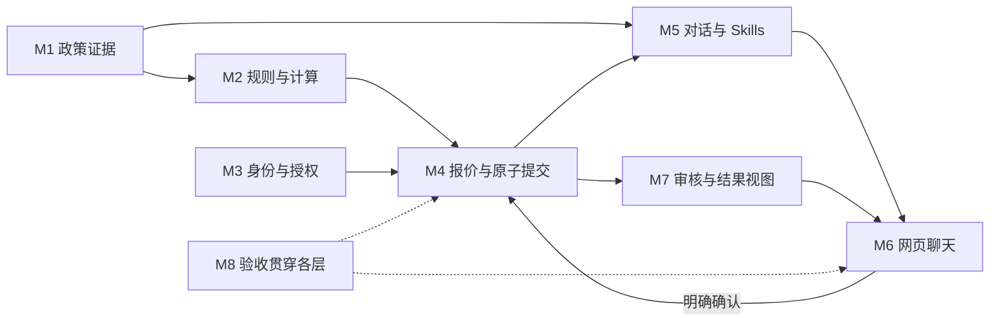

# Airline Service Assistant：总计划

状态：2026-09-20，用户已授权开发并逐模块复核。M1–M8 首版实现已接入；规则、接口、真实进程故障和浏览器测试已有实际结果，真实模型十场景验收已完整通过。当前事实以 [VALIDATION](VALIDATION.md) 为准，实际架构见 [DESIGN](DESIGN.md)。**方案复核不代表运行验收。**

沿用用户决定：简单网页聊天，只围绕项目 PDF 做最小 0→1；准确性优先，保留未来扩展接口；先完成全部计划并复核，再继续实现，不以六小时限制当前设计。最新分工是常规方案由助手敲定，只有新的资金口径、时间参数或影响产品方向的重要 A/B 选择再请用户决定。报价默认有效期已单独确认为 **5 分钟**。

阅读顺序：[本总览](PLAN.md) → [共同契约](CONTRACTS.md) → [各模块计划](#4-模块与依赖) → [跨模块复核](PLAN_REVIEW.md)。以下保留已确认的范围与实施约定；开发与验收进度见上述交付文档。

2026-09-20 新增已实现范围：本地文件账号注册/登录、游客私有入口禁用，见[账号方案与验证](LOCAL_ACCOUNTS.md)。

2026-09-20 用户进一步授权尝试真实业务改进，新增可选M9：[本地服务试用计划](SERVICE_TRIAL_PLAN.md)。其流程与原M1–M8共用规则、金额和权限；明确打开试用开关后才启用模拟客服/渠道处理，不改变原作业的现实接入边界。使用步骤见[服务试用指南](SERVICE_TRIAL.md)，完成情况以当前验证报告为准。

## 1. 最终目的与完成定义

交付一个可运行、可复现的航空客服对话助手。用户通过自然语言提出需求，系统结合三家虚构航司政策与当前模拟订单事实，给出准确解释；权限、事实和明确确认齐备后，通过有状态后端完成办理。评审能从页面、工具与持久化结果证明发生了什么。

对用户，每项请求最终必须明确是：已回答、待补充/登录、待确认、已办理、不符合政策、需人工审核，或暂未完成/结果待核实。回答“不知道”和说明缺什么，是正常能力；编造费用、授权、审批或成功不被接受。

真实用户可用网页体验，但身份核验、订单、库存、支付、退款均为模拟。一次“已办理”必须有实际提交的操作编号和更新后状态；一次“已记录审核”必须有审核单，但不代表有人正在审核或已经批准。

## 2. 首版范围与边界

| 需求 | 首版效果 | 自动办理边界 |
|---|---|---|
| 政策咨询 | 中英文问答、澄清航司/票价、展示条件及 PDF 出处 | 仅三份政策；未知明确说明，不补现实法规 |
| 订单查询 | 演示身份登录后查看本人/明确授权客票 | 不因订单号、同姓、付款而取得同行权限 |
| 自愿改签 | 选人/航段/日期、候选航班、准确报价、确认、提交及查询 | 同航司同路线；保留或政策允许的升档，价格/税/整票一致性明确；禁止降档 |
| 取消与退款 | 选中旅客整张完全未用票，分列票价、税费、附加项、现金/额度 | 部分已用、选段退票、不明分配转审核；票价不退不等于税费不退 |
| 独立退税 | 判断明确未用未退权益，可办理时独立报价/确认 | 不隐含取消；与有效乘机权益冲突未解决则审核 |
| 航司异常 | 先判断保护，提供合格免费替代航班或退款 | 部分使用退款保留已知权利，金额人工核定；同一权益不能又退又改 |
| 行李与额度 | 行李限额/已知加购费计算；额度发放、归属及到期判断 | 不做行李购买、额度兑换购买新票 |
| 人工审核 | 本地申请创建、去重、查询，说明已知权利与待核定项 | 不审批、不赋权、不上传证件或对外派单 |
| 多人体验 | 独立会话、逐票授权、同票冲突、重复确认防护 | 单实例；十会话验收，不承诺生产容量 |

不做真实航司/GDS、真实支付/退款、生产实名、短信、通用知识库平台、向量数据库、复杂后台、多机部署。新购票、换旅客/航司/起终点、代码共享、团体合同及奖励票不纳入自动办理。医疗、监护和争议需审核；资料未覆盖的宠物、贵宾室等不得推定允许或禁止。

升档需要明确的候选价格及整票票价类型一致性；不能因为实现困难把政策允许说成政策禁止，也不能为扩大自动覆盖而猜金额。

## 3. 真实使用预期

**游客咨询。** 用户问“行李能带多少”，缺航司时先澄清；必要时再问票价/航段。给出处和完整条件，不要求先登录。询问个人订单才要求登录；支持本地账号注册，演示身份另设“体验示例”入口。登录后重新选业务目标，不把游客自述订单当已核验事实。

**单人或多人改签。** 查获授权客票 → 明确选中旅客/航段/日期 → 查候选 → 后端报价 → 展示完整明细 → 点击具体动作确认 → 当前事实复核 → 一次事务提交 → 返回操作编号。确认前不改票、不锁座；任一选定旅客条件不满足，整笔不做部分提交。

**取消与逆向资金。** 区分自愿、误机、航变和使用状态。分别展示现金原路退款、本人旅行额度、不退部分；如“额度 60、退税 20”，不能写成“现金退 80”。确认后客票、财务和权益一起保存；已处理税费不能再退。

**无法自动处理。** 缺事实先澄清；没有资料明确不知道；权利明确而金额未明时说明需核定。用户明确要求办理且需审核时创建本地记录，不显示退款已完成，也不要求通过虚构邮箱提交证件。

**多人和故障。** A/B 的订单、报价和上下文互不串用；两个获授权会话争改同票，至多一笔基于旧版本的修改成功，不覆盖前次操作。不同客票可以分别办理。重复点击或提交后断网先恢复原结果；退出/重登后仍按当前权限查记录。

## 4. 模块与依赖

| 模块 | 主要责任与内部划分 | 计划 / 当前实现 |
|---|---|---|
| M1 政策资料与检索 | 导入核对、不可变快照、主题/全文查询、出处 | [M1](plans/01-policy-knowledge.md)；已接入固定知识版本及受控查询适配 |
| M2 业务模型与规则 | Money/时间、事实校验、资格、确定性算法、分项结果 | [M2](plans/02-business-rules.md)；首版已实现，见实际验证报告 |
| M3 身份与会话 | 本地注册/密码登录、演示身份、逐票/动作授权、对话归属、确认身份 | [M3](plans/03-identity-sessions.md)；首版已实现，见实际验证报告 |
| M4 有状态后端 | 订单/库存、候选/报价、提交/恢复、财务/权益、版本映射 | [M4](plans/04-booking-backend.md)；首版已实现，见实际验证报告 |
| M5 对话与 Skills | 对话状态、模型适配、技能注册、受控工具、事实输出 | [M5](plans/05-dialog-skills.md)；真实模型与七个 Skills 已接入 |
| M6 网页 | 聊天、选票/方案、明细确认、来源、结果与恢复 | [M6](plans/06-web-chat.md)；首版已实现，见实际验证报告 |
| M7 审核与执行记录 | 审核单、操作视图、脱敏诊断、交付导出 | [M7](plans/07-review-traces.md)；首版已实现，见实际验证报告 |
| M8 样例与验收 | 虚构样例、独立预期、边界/故障/并发、真实对话交付 | [M8](plans/08-validation-delivery.md)；独立测试和真实网页十场景全部通过 |

箭头表示业务依赖/数据流，不是按编号开发顺序。M2 只接事实接口，不反向查询 M4；M7 必要业务凭证由 M4 原子保存，不在提交后靠异步日志补成功证据。

## 5. 技术方案与共同契约

采用模块化单体：TypeScript / Node.js 24 LTS、Fastify、better-sqlite3/SQLite；网页 React + Vite 同源提供。M1 保留 Python 本地工具，由受控进程传明确知识版本查询。精确依赖版本和锁文件在实施环境核验时固定。

采用单体是为了让会话、权限、政策映射、订单、库存和模拟财务在一个业务数据库中协调；业务短事务中没有模型/网络/检索等待。知识快照独立存储，以校验组合与业务映射衔接。暂不引入队列服务、分布式锁或多模型路由。

[共同契约 C01–C09](CONTRACTS.md) 是跨模块语义唯一入口：

- C01：事实归属与模块责任。
- C02/C03：金额、权益、UTC 毫秒及报价/会话时间。
- C04：政策快照与规则包联合生效、历史及在途请求。
- C05/C06：报价、确认、收据、成功操作、恢复与状态区分。
- C07/C08：权限、上下文、可信展示、业务凭证和诊断。
- C09：真实模型服务与费用配置前提。

模型处理意图、必要追问、受控工具选择和对话衔接；金额、资格、访问、确认、提交和成功状态由确定性服务控制。业务 skills 引用共享计算核心，不能维护第二套算法；封装带来的性能收益要实测。

## 6. 金额、时间与版本

Money 使用 Google Money 结构语义：币种、字符串整单位、整数 nanos；TypeScript BigInt 精确运算，通用类型保留 9 位小数，本期 USD 业务输入/结算到分。数据库无损保存，网页精确格式化；超分精度且无舍入规则时拒绝，不自行四舍五入。

费用按政策的旅客/航段/整票粒度计算。正票价差逐段取正，负差价不抵别段或手续费；政府税另收退，现金与额度分开，未定义跨渠道轧差不执行。部分已用、不明历史价值或未知税额不猜。

统一 UTC Unix 毫秒，显示明确时区。报价创建后 5 分钟到期，完整有效确认在到期前收到才有效，等于到期已失效。报价不锁价/锁座，提交仍复核。初次聊天/报价不占政策窗口；有效请求内部排队保留首次有效接收时刻，当前权限和事实另行检查。

政策知识与规则形成不可变组合。按航司/有效请求时间选择组合，生效映射与业务提交同库排序；新知识不能自动配旧规则。历史操作保留原依据；已知旧政策失效时不能因新规则未完成而继续套旧规则。

具体三家费率、24 小时、30 天、365 天和前后 7 个 UTC 日历日边界见 [政策核对资料](knowledge/POLICY_GUIDE.md) 与 M2，不在各模块复制费率表。

## 7. 确认、并发与恢复

- 报价绑定操作者、登录会话、对话、动作、精确目标和事实版本。网页有可信确认入口，模型无财务提交工具。
- 新方案/目标变化在服务端使旧报价失效；处理新消息期间暂停同对话确认，避免旧方案与新意图竞争。只是解释报价不永久废弃原方案。
- 有效确认先存 Submission 收据，最终事务复核当前权限/版本/库存、按接收时间复算；所有选定客票、库存、资金、权益、报价消费和 Operation 一起提交。
- 同键相同请求恢复原收据；异参拒绝；同报价换键及不同报价重复消费权益都受后端约束。查已有成功优先于重新判断报价是否过期。
- 响应丢失/数据库暂不可用显示待核实，不凭查不到认定失败。重启隔离旧处理器；旧未完成收据核对操作后恢复成功或标中断，不自动补办。
- 退出/撤权与提交同库排序；查询和历史使用均检查当前权限。混合多人记录只给当前可见分项和小计，不能泄露全单总额。
- 业务必要凭证失败则回滚；独立诊断失败只标轨迹不完整，不推翻或重做已成功业务。

这些约束只覆盖本地模拟事务；将来真实支付有外部结果与对账，需要单独设计。

## 8. 验收与交付标准

M8 定义十个完整场景：A01 游客政策澄清、A02 付款人无权代办、A03 多人多段改签、A04 原出票/临近窗口、A05 国内国际分段计费、A06 取消额度与退税、A07 Basic 航变保护、A08 部分使用审核、A09 多会话与同票竞争、A10 提交后失联恢复。

每例检查对话、工具、数据库、界面和来源；真实模型测试与固定替身测试分别记录。额外覆盖全部票价/时间/精度边界、最后座位、多人回滚、撤权、政策更新、旧报价、崩溃及诊断故障。测试预期来自原文和独立算例，不能直接调用被测计算生成预期。

任何权限越界、未经确认写入、错误金额、重复退款、同票覆盖、部分提交、虚构成功或失效私有内容进入模型，都阻止最终验收。修复公共逻辑后重跑受影响层和完整十例。所有未运行项目保持 NOT_RUN。

当前逐模块结论和边界证据统一见 [DELIVERY_AUDIT](DELIVERY_AUDIT.md)；最新运行结果统一见 [VALIDATION](VALIDATION.md)。M1 测试、模型连接探测、本地业务测试、浏览器替身测试和真实模型验收是不同证据层，不能互相代替。

## 9. 验证边界与后续工作

首版的固定三份 PDF、单实例模拟业务是本次交付范围。生产认证、真实支付/GDS、多实例、新 PDF 的人工语义审核和历史计算执行器迁移仍在范围外。模型偶发超时与断流会明确失败并保留原业务恢复入口；不承诺生产容量或供应商持续可用。

用户设置的模型 Key 上限仍为 5 美元；应用不修改额度，不把 token 数折算成未经核实的美元账单。原作业六小时上限保留为题目要求，用户明确取消本轮设计/开发限时；不能声称本项目按六小时原限制交付。

## 10. 逐模块讨论与计划落地

### 10.1 已约定的工作方式

先计划、后整体复核、再实施；模块编号是责任编号，顺序按依赖关系。全部计划已确认，M1–M8 已实施；当前继续按用户要求审核和补齐交付缺口。

M1/M2/M3 的逐项选择沿用用户确认，M7 及其余常规细节按用户授权直接确定。只对新的金额/时间或影响方向的重要取舍提问；常规库、组件、错误处理和测试设计不重复请求拍板。报价 5 分钟已确认，无需再问。

任何后续变更同时检查最终用户任务、PDF 依据、事实前提、权限/资金影响、单/多用户一致性、失败恢复和可验证性。共享语义改变时先改 CONTRACTS，再同步受影响模块与 M8，不能只改末端页面。

### 10.2 计划阶段门槛及结果

| 门槛 | 当前结果 |
|---|---|
| M1–M8 独立计划齐备，确认/委托来源清楚 | 已完成 |
| 金额、时间、权限、版本、原子性、恢复及展示一致 | 已完成本轮文档复核，见 PLAN_REVIEW |
| 正向、逆向、审核、多用户与失败路径逐项推演 | 设计预期保留；后续运行结果见 VALIDATION，最终十例已通过 |
| 已有 M1 计划和总计划同步，避免旧待定项误导 | 已同步；联合版本已接入并有针对性验证 |
| 明确实施依赖顺序与外部配置前提 | 已按以下依赖顺序实施 |

文档基线已经可以供后续实施使用。实现中若发现假设不成立，记录证据、修改相应计划；新敏感决定再交用户确定，不默默收窄范围或改金额规则。

### 10.3 已采用的实施顺序

1. 固定共同类型/状态与独立政策算例，补齐 M2 纯规则；M8 从此开始。
2. 建业务库/迁移/样例和 M3 身份授权；落实 M7 必要凭证/审核单的基础存储。
3. 完成 M4 查询、报价、事务提交及恢复，同时接入 M1/M2 联合版本；先验证财务/权限/并发不变量。
4. 接入 M5 skills/受控工具和 M7 诊断，用替身测试失败路径；配置实际模型后另做真实合同测试。
5. 完成 M6 聊天与确认/恢复页面，串起全链路；最终跑 M8 十例、检查交付说明与证据。

这是实施依赖顺序，不是按小时切割的工期承诺；这些功能已经实施，逐项证据见交付复核。

## 11. 文档与最终产物

当前文档包括本总计划、共同契约、八份模块计划、整体复核及已有政策资料/模块验收。README、DEMO 逐步复现、DESIGN 实际实现/取舍/投入说明、虚构样例、真实验收结果、脱敏轨迹和截图均已提供，统一入口为 DELIVERY_AUDIT。

实际代码布局保留 `src/airline_kb`，新增 TypeScript 服务的 domain、identity、booking、assistant、operations 与 web；具体目录是组织选择，不复制计算或订单真相。知识发布、业务数据库、测试数据库分开；密钥不进入源文件、快照和导出。

## 12. 原始依据

- [任务说明](../assignment-airline-2026-09-15.pdf)：覆盖三家航司，问答/预订/改退，有状态模拟 API，自选技术和界面，运行/样例/8～10 案例/轨迹/设计说明及实际投入记录。
- [Northstar Air](../airline-policies/northstar-air/Passenger_Policies.pdf)、[Bluehaven Airways](../airline-policies/bluehaven-airways/Passenger_Policies.pdf)、[Suntrail Air](../airline-policies/suntrail-air/Passenger_Policies.pdf)：业务政策依据。
- [中文核对资料](knowledge/POLICY_GUIDE.md)：辅助阅读与算例，源 PDF 为最终依据。

模块划分、技术栈、演示身份、报价五分钟、数据库事务和验收场景是本项目设计选择，不冒充 PDF 原文要求。
