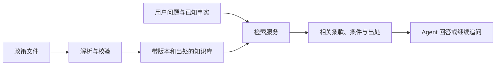
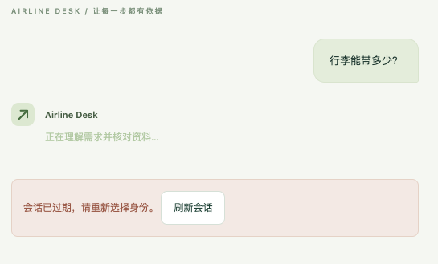
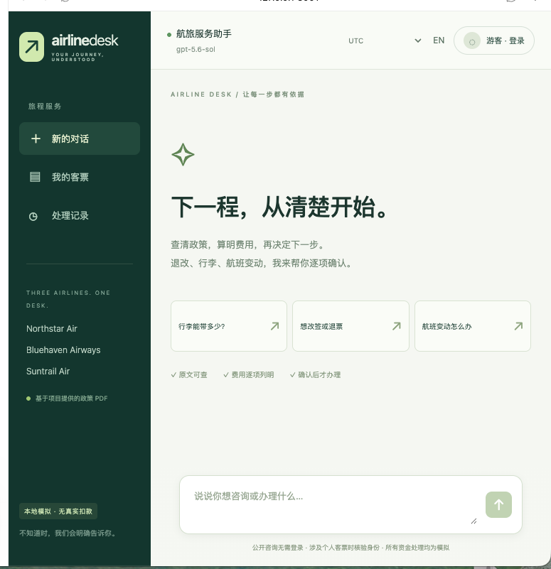

# 本次项目会话导出（脱敏对话版）

会话：整理项目内容与要求；ID：`01a0aec0-c218-7081-abcf-d1fee653dbac`。

范围：2026-09-17T09:44:36.491Z 至 2026-09-20T07:39:44.904Z（UTC），共 183 条用户/助手可见消息，2 张用户截图。

此文件按本机保存的 7 个历史继续/修改段排序。早期方案、模型尝试与同一句请求的修订均作为历史保留，不代表当前配置；最终基线以 [当前计划](../docs/DELIVERY_BASELINE.md) 和 [交付报告](../docs/DELIVERY_REPORT.md) 为准。

截至本次“打包并生成交付文档”的用户请求。本轮导出动作、随后生成的报告和最终回复不在这一固定快照内。密钥和令牌已替换；自动环境文本、内部提示、隐藏推理、工具原始载荷和压缩摘要不导出。可读格式转换了问答选择结果、附件与本机路径，但未补写缺失对话或改写历史结论。

原始日志不随包附带。来源分段、消息数、脱敏计数及附件指纹见 [清单](export-manifest.json)；机器可读版本见 [messages.jsonl](messages.jsonl)。


---

## 历史记录段 1


### 001 · 用户 · 2026-09-17T09:44:36.491Z

读一下项目中的文件，整理后告诉我具体的项目内容和要求


### 002 · 助手进度 · 2026-09-17T09:44:40.260Z

我先查看项目文件和说明，梳理项目目标、现有内容、功能要求及交付标准。


### 003 · 助手进度 · 2026-09-17T09:44:59.776Z

项目目录目前只有 4 份 PDF：一份任务说明和三家航空公司的乘客政策，没有代码。我会使用 PDF 技能逐份读取，区分作业的硬性要求与政策文档中的业务规则。


### 004 · 助手进度 · 2026-09-17T09:45:46.484Z

任务要求已经明确：需要做一个覆盖三家航空公司的对话助手，既能解释政策，也能通过有状态的模拟后端完成查单、改签和退票流程；开发时间上限是 6 小时。政策里的关键差异包括出票日期、国内／国际航段、起飞前时间窗口，以及航司取消航班时适用的特殊规则，我正在核对这些边界。


### 005 · 助手答复 · 2026-09-17T09:48:02.674Z

我已读完项目里的 **4 份 PDF，共 20 页**。目前目录里只有任务说明和政策资料，没有代码、接口定义或样例订单。

这是一个 **限时 6 小时的航空客服对话助手开发作业**：根据三家航空公司的政策回答问题，并通过后端完成订单查询、改签、取消和退款申请。要求按“准备给真实用户初步试用的产品”来考虑可靠性。

下面把明确要求和业务重点整理出来。

**项目提供的资料分别是什么**

| 文件 | 内容 |
|---|---|
| `assignment-airline-2026-09-15.pdf`，2 页 | 项目范围、交付物、时间限制和评审标准 |
| Northstar Air 政策，6 页 | 全服务航空公司，v2.0，2026-01-01 生效 |
| Bluehaven Airways 政策，6 页 | 低成本航空公司，v3.0，2026-07-01 生效，包含改签费用的新旧规则 |
| Suntrail Air 政策，6 页 | 国内与国际航线采用不同规则，v1.4，2026-03-01 生效 |

三家航空公司、地点、联系方式都是虚构的，文档里的网址和邮箱不是真实服务入口。

**功能上，明确要求完成这些能力**

1. **政策问答**：利用提供的政策文档回答旅客问题，包括退改签、退款、行李等。
2. **查询订单**：调用后端取得预订信息，为后续操作提供依据。
3. **改签、取消和申请退款**：根据适用规则帮助用户办理，退款仅限符合条件的情况。
4. **覆盖全部三家航空公司**：不能只做一家。题目特别指出，用户不会一开始就说明航空公司，因此需要通过追问或订单信息确定。
5. **后端可以模拟，但必须有状态**：接口和样例数据自行设计；操作后要能体现订单变化，不能每次都固定返回“成功”。

技术语言、框架、模型和开发工具自由，允许使用 AI 编程工具。CLI、简单网页或聊天 API 都可以，视觉效果不是重点。**多人同时使用是加分项，不是必做项**；简化实现可以接受，但要说明假设。以上来自任务说明。:codex-file-citation{path="../assignment-airline-2026-09-15.pdf" purpose="source"}

**最终必须交付的内容**

| 交付物 | 具体要求 |
|---|---|
| 可运行项目 | 包含安装、启动说明和样例数据 |
| 可复现的演示证据 | 真实对话截图，或者精确的操作说明：运行哪些案例、输入什么、预期发生什么 |
| **8～10 个测试案例** | 放在仓库中，每个案例写明预期行为和实际是否做到；必须同时有成功和失败路径。JSON、CSV、Markdown 表格均可 |
| 一段对话的执行记录 | 展示检索了哪些来源、请求了哪些操作、操作返回什么，以及是否决定转人工；不展示隐藏推理 |
| 简短设计说明 | 选择了哪些场景及原因、主要设计取舍、如何评估效果、已知限制和下一步 |
| 实际耗时 | 开发不超过 **6 小时**；提前完成可以停止，并说明主动省略了什么 |

评审明确看四点：**问题识别、优先级选择、实现质量，以及支持你决策的证据**。后续面试还会用额外场景讨论系统行为。

**三家航空公司的政策差异，需要真正影响回答和操作**

下面金额均为美元。“提前”指距起飞 **至少 24 小时**，“临近”指 **不足 24 小时但仍未起飞**。

| 规则 | Northstar | Bluehaven | Suntrail |
|---|---|---|---|
| Basic 改签 | 提前 $70；临近禁止 | 均禁止 | 提前仅国内允许，$40；临近禁止 |
| Standard 改签 | 提前 $25；临近 $60 | 提前 $55 或 $85；临近禁止 | 提前国内 $20／国际 $65；临近国内 $50／国际 $100 |
| Flex 改签 | 两个窗口均 $0 | 提前 $15；临近 $45 | 提前均 $0；临近国内 $0／国际 $25 |
| Standard 自愿退票 | 提前扣 $40、临近扣 $80，余款转旅行额度 | 不退票价，也不给旅行额度 | 提前国内扣 $25 后转旅行额度；其他情况不退票价 |
| Flex 自愿退票 | 两个窗口均免费原路退票价 | 仅提前可扣 $30 后转旅行额度 | 提前：国内免费原路退，国际扣 $50 原路退；临近：国内扣 $20 原路退，国际扣 $75 后转旅行额度 |
| 符合保护条件的时刻变更 | 与原出票时刻相差 ≥120 分钟 | ≥180 分钟 | ≥120 分钟 |
| 加购一件托运行李 | $45，最多 23kg | $40，最多 20kg | $50，最多 23kg |

改签费和加购行李费均按**每位旅客、每个相关航段**计算；退票费按**每位旅客、整张未使用客票的行程**计算。自愿退票表不适用于只退某个航段、已经飞过部分行程或符合航司异常保护的情况。

Northstar 的特点是 Flex 较灵活，Basic 和 Standard 都包含一件 23kg 托运行李。:codex-file-citation{path="../airline-policies/northstar-air/Passenger_Policies.pdf" purpose="source"}

Bluehaven 最容易出错的是 **Standard 改签费用按原始出票时间选择**：早于 `2026-07-01 00:00:00 UTC` 为 $85，该时刻及之后为 $55。不能使用申请时间或重新出票时间来选费率。Basic 和 Standard 均不含免费托运行李。:codex-file-citation{path="../airline-policies/bluehaven-airways/Passenger_Policies.pdf" purpose="source"}

Suntrail 必须区分国内、国际：改签和行李按每个航段分别判断；整张票自愿取消时，只要包含一个国际航段，整段行程就按国际规则判断。这里的“国内”是指起终点都在虚构的 Aster 共和国。:codex-file-citation{path="../airline-policies/suntrail-air/Passenger_Policies.pdf" purpose="source"}

**这些共同规则，是实现时不能漏掉的业务边界**

- **报价之后要确认，确认之后才执行。** 报价本身不能改变订单。完整申请要求资料齐全、权限已验证，并接受相关费用。
- **时间窗口使用完整申请的收到时间。** 全部按 UTC；恰好提前 24 小时属于提前窗口，恰好到起飞时间的新申请按误机规则处理。提前发一句消息不能保留时间资格。
- **免改签费仍可能需要补差价。** 新票更贵时补正差价；更便宜时不退差价，也不能用负差价抵扣手续费。税费单独结算。
- **不能只凭订单号操作别人的票。** 付款人或主预订人不自动拥有其他成年旅客的查看、取消、改签权限。代办需要明确授权和身份验证。
- **要区分订单、旅客客票和航段。** 一个订单可以有多位旅客，每张票可以有多个航段；取消自己的整张票不应连带取消同行人的票。
- **票价不退，不代表税费不退。** 三家都允许申请退还未使用的政府税费，包括不可退票和误机情况。自愿取消时，已购座位、行李等附加服务不退款。
- **旅行额度不是现金退款。** 只能本人在同一家航司使用，不可转让或提现；有效期为签发后精确的 365 天，兑换和新行程开始都必须早于到期时刻。
- **行李额度不能合并。** 两件各 23kg 不意味着允许一件 46kg；旅客之间也不能共享额度。超重、超尺寸或更多额外行李需要人工审核，不能自行编造收费。

航司取消航班或达到规定幅度的时刻变更，还会触发一套**优先于普通退改签及误机限制**的规则：

- 可以免费改到原出发日期前后 7 个日历日内、同航司、同目的地、同票价类型的可用航班，不收改签费或差价。
- 完全未使用的受影响行程，可以原路退还全部票价、未使用税费和未使用附加服务，包括 Basic。
- 已经开始旅行的，未使用受影响部分仍有退款权，但金额需人工核定。
- 在异常通知后 30 天内提出选择，恰好第 30 天仍有效；超期需人工审核，不能直接判定无权退款。

此外，部分使用后的退款、仅取消部分航段、混合票价、医疗例外、监护关系及权限争议，都应进入人工审核。文档未覆盖的宠物、贵宾室、会员权益等问题，也不能自行推断“允许”或“禁止”。

从实现角度看，**我的判断是：重点在于把“理解问题 → 查订单 → 找对政策 → 判断资格和金额 → 用户确认 → 后端更新 → 返回可核实结果”这条流程做完整。** 这是对题目的设计解读；文档没有指定必须使用向量数据库、某种 Agent 框架或真实航空接口。选用什么方案，需要在 6 小时限制内用运行结果和测试证据说明理由。


### 006 · 用户 · 2026-09-17T10:01:22.843Z

我们先对齐一下最终目的，你理解我们要做什么了吗？包括功能，最终效果，以及假设一个/多个用户真实使用会达到怎样的预期，以及边界和测试，你有理解清楚吗？请做一个plan和方案设计的草稿，并划分好模块


### 007 · 助手进度 · 2026-09-17T10:01:27.982Z

我的理解是：最终要交付一个能让用户完成真实业务流程、且结果可验证的航空客服助手。我们先对齐它应该做到什么、哪些情况必须拒绝或转人工，再据此划分模块、交付步骤和测试标准。我会把已明确的要求与方案中的假设分开写成草稿。


### 008 · 助手进度 · 2026-09-17T10:03:15.690Z

方案会把“能否办理、费用多少、是否有权限、订单怎样变化”放在后端校验，对话模型负责理解需求、追问和解释结果。多人使用会分开考虑：不同用户之间的信息隔离，以及两个人同时操作同一张票时的冲突与重复请求；首版拟覆盖单实例下这两类情况。


### 009 · 用户 · 2026-09-17T10:03:20.716Z

问题：首版你希望用什么入口来体验和验收？我会先按“简单网页聊天”起草，核心业务模块保持可供其他入口复用。
用户回答：简单网页聊天（推荐）


### 010 · 助手进度 · 2026-09-17T10:03:42.925Z

已确定用简单网页聊天来体验和验收。我会把草稿写入项目，明确“用户看到的结果”和“后台必须验证的状态”；查不到订单、没有权限、政策不允许、需要人工审核、执行失败，也会分别定义预期行为，避免把所有情况都当成成功办理。


### 011 · 助手进度 · 2026-09-17T10:09:00.492Z

草稿已写好，划分了 8 个模块和 10 个验收场景。验收会同时检查回复、实际金额、订单变化和退款记录；另有规则测试覆盖完整票价矩阵与时间边界。单用户流程、多人信息隔离、同票冲突、重复提交及提交后响应丢失，都已写明预期结果。


### 012 · 助手答复 · 2026-09-17T10:10:46.019Z

理解了。**最终目标是交付一个可供用户实际体验的航空客服助手：能够理解需求、查明事实、应用正确政策，并把获授权的操作执行到可核实的结果。**

我已经把方案写成 [PLAN.md 草稿](../docs/PLAN.md)，包含产品目标、模块、接口、数据模型、边界、测试和实施顺序。目前只是设计，尚未开始功能开发。

我们已确认采用**简单网页聊天**。我对最终效果的理解如下。

**用户应能完成五类事情：**

- 咨询三家航司的政策，获得适用条件和来源。
- 查询自己或明确获授权的客票。
- 查询改签方案、了解费用、确认并完成改签。
- 取消选定旅客的客票，申请符合条件的退款或旅行额度。
- 遇到无法自动处理的情况，得到准确解释和人工审核记录。

每次请求都应明确落到“待补信息、待确认、已完成、不符合政策、需人工审核、暂未完成”中的一种状态。

例如用户说“帮我改到明天”，完整体验应是：

> 确定客票和航段 → 查询可用航班 → 展示新旧方案及费用 → 用户确认 → 后端重新校验并执行 → 返回操作编号和新订单。

**确认前订单不变；完成后刷新页面或重新查询，结果仍然存在。**

多人使用的预期也需要具体定义：

| 使用情况 | 应达到的行为 |
|---|---|
| 两个人同时咨询不同订单 | 对话、订单、政策依据、报价互不串用 |
| 同一订单有多名旅客 | 每个人只能查看和操作本人或获授权的客票 |
| 两个获授权会话同时改同一张票 | 一笔成功，另一笔发现订单变化后重新报价，不能覆盖 |
| 用户重复点击确认 | 返回原结果，不重复收费、退款或发放额度 |
| 操作成功但网页没收到响应 | 查询原操作结果，不能直接再执行一次 |

任务书将并发处理列为加分项；**我的草稿建议覆盖单实例下的信息隔离、同票冲突和重复提交**，范围止于小规模演示。

方案划分为 8 个模块，均在同一个应用内：

| 模块 | 主要责任 | 验收重点 |
|---|---|---|
| M1 政策资料与检索 | 保存三家政策、版本、章节和来源，检索适用条款 | 不混用航司，不丢失表格条件 |
| M2 业务规则计算 | 判断资格，计算费用、退款、行李额度和异常权益 | 金额和边界正确，可独立测试 |
| M3 身份与会话 | 演示身份、旅客授权、会话隔离、确认绑定 | 不能通过姓名、订单号或模型指令越权 |
| M4 有状态预订后端 | 订单、库存、报价、提交、退款、额度、冲突及重复请求 | 操作真实改变模拟状态，失败不会留下半成品 |
| M5 对话编排 | 理解需求、追问、调用工具、解释结果 | 缺信息不猜测，执行失败不宣称成功 |
| M6 网页交互 | 聊天、订单卡、报价卡、确认按钮、来源和结果 | 用户知道操作对象、金额及当前状态 |
| M7 人工审核与执行记录 | 模拟审核单、检索和操作记录 | 能追查依据与结果，不暴露隐藏推理 |
| M8 样例与验收 | 固定样例、规则测试、故障模拟、对话验收及复现说明 | 评审可以照步骤重现实际结果 |

其中一个核心设计决定是：**模型负责交流和解释；后端负责权限、资格、金额、确认和状态变化。** 模型不能自己生成一个“用户已确认”的字段就完成退款。

边界也已经写清楚：

- 首版使用模拟身份、航班、订单和资金记录，不连接真实航司与支付系统。
- 自动改签先限定保留原票价类型；升档可解释政策，但办理转人工，并说明这是系统能力限制。
- 部分使用后的退款、选段退票、医疗例外、监护及授权争议转人工，不能自动批准。
- 文档未覆盖的规则明确说明未知。
- 区分“政策不允许”“系统暂不支持”“后端执行失败”，不能混为一谈。
- 航司异常具有优先规则；Basic 不可自愿退款，并不意味着航司取消后也不能退款。

测试会分成三层：

1. **规则测试**：覆盖三家完整票价矩阵，以及 24 小时、出票日期、120／180 分钟异常阈值、退税、额度到期等边界。
2. **后端测试**：验证权限、确认、状态持久化、冲突、重复提交、库存变化和故障恢复。
3. **真实模型与网页验收**：从用户输入跑到实际结果，检查追问、来源、金额和订单变化。

草稿已经列出 **10 个具体验收场景**，包括政策澄清、越权拒绝、多旅客多航段改签、新旧出票费率、国内国际混合航段、旅行额度退款、航司异常、部分使用转人工、并发冲突、响应丢失后的恢复。它们目前全部是“未运行”，之后必须填写真实结果。

**验收不能只看回复是否顺畅。** 未经确认写入、越权、金额错误、重复退款、覆盖其他操作、虚构成功，任何一项出现都不能算通过。

实施顺序拟定为：

> 政策与样例 → 规则计算 → 身份与状态后端 → 对话与执行记录 → 网页 → 完整验收与交付。

草稿按任务书的 6 小时总投入做了时间分配，也明确要求计入前期分析和文档耗时。具体技术栈、模型和凭据尚未锁定；这些选择不会改变上述产品目标、模块责任和验收标准。


### 013 · 用户 · 2026-09-18T03:11:17.021Z

你先不用考虑六个小时的时间耗时什么的，你先好好讨论方案，我们一个一个子模块来讨论，你可以向我提出问题由我来确定方案，然后每确定一个子模块我们就写一个plan。另外在这过程中你要时刻对齐最终目的，还有就是，需要保证方案合理性。


### 014 · 助手进度 · 2026-09-18T03:11:30.240Z

好的，我们先逐个模块讨论。六小时限制先不作为方案取舍的依据；每个模块都先明确用户预期、规则、边界和验收方式，由你确定后再写对应的 plan。我会先核对现有草稿，把其中尚未确认的设计与已确定事项分开。


### 015 · 助手答复 · 2026-09-18T03:14:25.965Z

可以。我们按 **“讨论一个模块 → 明确取舍 → 你确定 → 写独立 plan”** 推进。

我已更新 [总览草稿](../docs/PLAN.md)：移除了按小时分配的计划，并将之前提出的技术栈、功能限制和接口设计全部标为待讨论。此前“升档统一转人工”等建议，也需要重新判断，不能因旧的时间预算直接定下来。

整个过程始终对齐这个目标：

> 用户通过网页聊天，依据正确的航司政策和订单事实，完成有权限、经确认、结果可核查的查询与办理；遇到不能完成的情况，得到准确解释和下一步。

每个模块，我们都会回答六个问题：

1. **用户价值**：它支持哪一种真实使用场景？
2. **范围与责任**：负责什么，依赖哪个模块？
3. **具体行为**：输入是什么，正常情况下输出什么？
4. **边界与异常**：信息缺失、规则冲突、执行失败、多人使用时怎么办？
5. **方案取舍**：有哪些选择，为什么推荐其中一个？
6. **验收依据**：用什么案例证明行为正确？

你决定需求和重要取舍；我负责检查政策依据、技术前提、跨模块矛盾及复杂度。存在关键不确定性时，先验证再定案。测试会随每个模块一起设计。

我们先讨论 **M1：政策资料与检索**。它的目标是：**给后续回答和业务判断提供完整、适用、可追溯的政策依据。**

例如用户问 Bluehaven Standard 改签多少钱，这个模块提供的依据需要包含：

- 所属航空公司、文档版本和来源页码；
- 原始出票时间对应的两档费用；
- 起飞前时间窗口；
- 每人、每航段的计费单位；
- 另付正票价差额等相关条款。

只找到一句“改签费 $55”是不够的。后续如何结合订单计算最终费用，我们在业务规则模块单独讨论。

**先确定第一个问题：政策资料需要怎样维护和更新？**

| 选择 | 具体效果 | 取舍 |
|---|---|---|
| **A．支持文件更新，校验后启用（推荐）** | 工作人员替换或添加政策文件，执行导入；保留版本和来源，检查通过后启用 | 支持政策变化，维护流程明确；暂时无需设计管理网页 |
| **B．只使用当前固定资料** | 围绕现有三家 PDF 建立政策资料，更新时由开发人员修改并重新发布 | 范围最明确，但政策维护依赖开发 |
| **C．提供政策管理网页** | 工作人员可上传、预览、审核、启用和回退政策版本 | 维护更方便，同时需要管理权限与发布流程 |

我倾向 **A**：当前项目已经存在按出票时间区分费用的规则，可追溯的政策维护有实际价值；管理后台是否需要，可以独立判断。

**你更倾向 A、B 还是 C？** 先确定这一点，再继续讨论政策如何组织、检索，以及怎样验证没有漏掉关键条件。


### 016 · 用户 · 2026-09-18T06:56:09.737Z

更倾向于A，但是这里有个问题，如果文件特别多，我需要建立agent的知识库吧？


### 017 · 助手进度 · 2026-09-18T06:56:20.685Z

你倾向 A，我先记为当前方向，暂不把整个模块定案。我会查一下知识库的检索设计，重点看文件增多后，怎样找到正确版本、保留适用条件，并为回答提供可核查的出处。


### 018 · 助手答复 · 2026-09-18T06:57:45.592Z

**是的，文件多起来后，我们应该为 Agent 建立可检索的知识库。** 你倾向的 A 与此兼容：A 决定“资料怎样更新”，知识库负责“资料怎样组织、查找和引用”。

运行时，Agent 根据用户问题检索相关资料，再结合结果回答，这就是通常说的 **RAG（检索增强生成）**。知识库需要包含原文、来源信息、版本和检索索引；向量数据库可以承担其中一部分索引工作。[RAG 官方说明](https://learn.microsoft.com/en-us/azure/search/retrieval-augmented-generation-overview)

结合我们的最终目标，我建议将 M1 按下面这条流程设计：



这里需要做好五件事。

| 能力 | 在我们项目中的作用 |
|---|---|
| **资料解析** | 提取 PDF 文字和表格，保留标题、表头、计费单位及相邻说明，避免把金额与条件拆散 |
| **分类与版本** | 每段内容标记航司、文档版本、章节、页码、生效条件和原文件 |
| **检索** | 根据已知航司和适用范围筛选，再寻找与问题相关的条款 |
| **关联补全** | 找到主要条款后，补充税费、异常航班、误机等相关例外 |
| **更新与发布** | 新文件先解析、校验，通过后启用；保留历史版本和执行记录所引用的原文 |

对于大量文件，我倾向于评估 **关键词与语义结合的混合检索**：关键词适合航司代码、票价名称、日期等精确条件；语义检索帮助处理“我不去了”“能退多少钱”这类自然表达。是否增加重排序，应由实际检索测试决定。[混合检索官方说明](https://learn.microsoft.com/en-us/azure/search/hybrid-search-overview)

**航空政策的难点，还在于“找到相似内容”之后，是否找全了适用条件。**

例如用户问：

> “我的 Bluehaven Standard 机票改签多少钱？”

检索结果需要同时覆盖：

- 原始出票时间对应的 $55／$85 规则；
- 至少提前 24 小时的限制；
- 每人、每航段收费；
- 正票价差额另付。

如果只召回“$55”，即使文字与问题高度相关，也不足以回答。用户没有说明出票时间时，助手应该追问，或列出条件分支。

因此，我建议把知识库的输出定义成**有出处的政策依据**。具体订单是否符合条件、最终金额多少，仍由后续业务规则模块结合订单事实校验。这两个模块需要共享可追溯的规则来源，避免问答说一套、实际办理用另一套。

多人使用时，可以共享同一份已发布的公共政策知识库；各人的订单、授权和对话上下文分别管理。这样，一份政策更新可以服务所有用户，同时保持个人业务信息隔离。

验证知识库是否合理，也不能只检查“文件导入成功”。至少要测试：

- 增加大量相似或无关文件后，是否仍找到正确航司的完整条款。
- 新旧版本并存时，是否根据适用条件选取依据，且来源能够回查。
- 表格、例外条款是否遗漏；找不到充分依据时，是否明确告知不足，而不是补写答案。
- 更新失败是否影响正在使用的版本，过去的操作依据是否仍能追溯。

**所以，M1 可以朝“可更新、可检索、可追溯的政策知识库”来设计。具体存储和检索技术，应该依据资料规模与测试结果确定。**

接下来先确认一个会影响方案的重要问题：**你说的“文件特别多”，是希望为未来扩展做好准备，还是首版就要接入一批较大的资料集？如果是后者，大约多少份，内容是否都属于航空政策？**


### 019 · 用户 · 2026-09-18T07:07:39.542Z

本次项目属于交付作业，所以我们不展开，可以先拿“希望为未来做好准备”来做基准。除了这个，这一模块还有没有其他需要敲定的工作？一次性都说清楚。


### 020 · 助手进度 · 2026-09-18T07:08:07.972Z

我会把这一模块剩余的决策一次列全，并给出推荐方案。范围按你刚确定的基准收住：本次服务好三家航司的作业资料，保留将来增加文件的能力，不展开成通用知识库平台。


### 021 · 助手答复 · 2026-09-18T07:10:16.809Z

还有。**M1 剩下需要确定的是资料处理、检索行为、更新规则和验收标准。** 我把本轮能识别的决策一次列全，并给出推荐方案，你可以集中修改。

目前已经对齐的基准是：

- 本次服务于交付作业，实际资料就是三家航司的政策。
- 采用你倾向的 A：文件导入、校验后使用。
- 为未来增加文件保留扩展能力，本次不建设通用知识库平台。

M1 的最终目标应是：**让助手取得正确、足够完整、能够追溯到原文的政策依据，支持后续回答和业务办理。**

以下是我建议确定的全部事项。

| 编号 | 待确定事项 | 推荐方案与理由 |
|---|---|---|
| **1** | **哪些资料是依据** | 只使用项目提供、经过导入校验的航空政策。任务说明属于开发要求，不进入乘客政策检索。回答政策时不通过互联网或模型常识补写规则。 |
| **2** | **支持哪些文件** | 本次支持现有文字型 PDF，包括其中的表格。扫描件、图片型政策检测后明确提示无法导入；OCR 和其他格式留作扩展。 |
| **3** | **如何解析与校验** | 自动提取内容，按章节整理，保留表格表头、适用条件、单位和例外说明。对现有三份文档进行人工核对，尤其核对金额、时间、否定条件和表格。解析成功不等于内容正确。 |
| **4** | **知识怎样组织** | 保存原始 PDF、章节内容及元数据：航司、文档版本、来源页码、章节、内容标识和适用时间信息。相关章节之间建立关联，例如退票条款关联税费、误机和航司异常。 |
| **5** | **首版怎样检索** | 采用“已知条件筛选 → 主题与全文检索 → 补充相关章节”。保留可替换的检索接口，未来可以增加向量或混合检索。本次先验证当前资料上的准确性与完整性。 |
| **6** | **支持什么语言** | 支持中英文提问，按用户语言解释；英文政策原文保留。中英文表达相同问题时，应找到相同政策依据。中文翻译属于解释，不成为新的政策原文。 |
| **7** | **用户是否看到出处** | 默认展示简短出处，如“Bluehaven · 第 2 页 §2.1”；可展开查看相关原文、文档版本并打开 PDF。普通回答不展示检索分数等调试信息。 |
| **8** | **缺信息或证据不足怎么办** | 缺少决定性条件时返回需要补充的字段；没有充分依据时明确说明不足；发现无法消解的政策冲突时停止给出确定结论。不能将“没检索到”解释成“政策允许”或“政策禁止”。 |
| **9** | **文件怎样更新** | 更新文件后重新导入、校验，再启用新版本；相同内容重复导入不产生重复资料。失败时继续使用原已发布版本。保留历史来源，供过去的回答和操作追溯。 |
| **10** | **如何与其他模块衔接** | M1 提供政策证据和版本，不直接操作订单。订单事实与权限由对应模块提供，最终资格和金额由业务规则模块校验。政策更新涉及费用或资格时，需要与业务规则同步验证，不能只更新问答内容。 |

第 5 点需要解释一下：**上一轮提到的混合检索，是大量文件场景下的候选方案。现在范围已经收敛，我建议先采用适合当前资料的检索方式。** 全文索引本身能够搜索文档内容，例如 SQLite FTS5 提供此能力；混合检索则结合关键词与向量查询。是否引入后者，应由漏检案例和测试结果决定。[全文检索说明](https://www.sqlite.org/fts5.html)、[混合检索说明](https://learn.microsoft.com/en-us/azure/search/hybrid-search-overview)

这里的“主题检索”也需要限定：可以维护“改签、取消、行李、航司异常”等主题及章节关系，**具体政策内容仍来自文档，不能维护一套脱离文档的固定问答。**

对于 Agent，M1 应提供一个明确的结果契约。一次检索返回：

- 找到的原文条款及关联条款；
- 航司、版本、章节、页码和来源标识；
- 已知的适用条件与尚缺的信息；
- 检索状态，例如找到依据、需要补充条件、依据不足、发现冲突或服务失败。

**“找到依据”并不代表“已经允许办理”。** 例如找到了退票规则，还需要结合用户的票价、使用状态、申请时间和航司异常情况判断。追问怎样表达由对话模块处理，具体金额由业务规则模块处理，这样各模块的责任才清楚。

更新和多人使用还需要两条一致性约定：

- **同一次检索使用一致的已发布资料快照**，避免文件正在更新时，半段答案来自更新前、半段来自更新后。返回结果带版本，供后续报价和提交时检查。
- **公共政策知识库可以共享，订单与对话上下文分别管理。** M1 不把旅客订单、身份或聊天记录混入公共政策索引。

注意，版本选择要依据适用条件，不能简单“永远取最新”。Bluehaven 当前文档本身就同时保留了新旧出票费率；即使只有一个 PDF，也不能丢掉其中的旧费率条款。

本模块的验收，我建议把以下项目全部写进独立 plan：

| 测试方向 | 验收内容 |
|---|---|
| 航司隔离 | 同样询问改签，三家分别返回正确来源；明确要求比较时，按航司分开返回 |
| 条款完整性 | Bluehaven Standard 同时召回出票日期、时间窗口、计费单位和正差价说明 |
| 例外关联 | 询问不可退票时，能取得税费与航司异常相关条款，不能只返回“不退款” |
| 中英文与不同说法 | “取消航班”“我不去了”“cancel my booking”等表达取得相应依据 |
| 缺失与未知 | 航司不明、资料未覆盖、检索失败分别处理，不编造确定答案 |
| 来源正确 | 返回的页码、章节和原文能够实际打开核对 |
| 导入与更新 | 重复导入不重复；坏文件不替换已发布资料；旧回答的出处仍能追溯 |
| 扩展准备 | 加入少量干扰资料或新的政策版本后，验证索引可以重建、现有案例仍正确；不据此宣称已验证大规模容量 |

每个检索案例都应事先标注**必须找到哪些条款**。验收时检查条款覆盖和来源正确性，而不只看回答听起来是否合理。具体检索参数由这些测试决定，不需要你逐个选择分块长度、返回条数或排序权重。

对“未来做好准备”，本轮落实到三个地方就足够明确：**资料通过导入流程接入、来源与版本有稳定标识、检索实现可以替换。** 将来新增航司政策可以复用这些能力；新增航司的自动办理规则仍需要另行验证，不能承诺上传 PDF 后就自动具备完整业务能力。

**以上就是本轮 M1 的完整待定方案。你可以直接回复“按上述推荐方案确定”，或者按编号指出要调整的地方。确定后，我再写 M1 的独立 plan，并同步修正总览中相关的旧假设。**


---

## 历史记录段 2


### 022 · 用户 · 2026-09-18T07:17:38.176Z

本次项目属于交付作业，暂时围绕着项目提供的pdf来实现，所以我们不展开，可以先拿“希望为未来做好准备”来做基准。除了这个，这一模块还有没有其他需要敲定的工作？一次性都说清楚。


### 023 · 助手进度 · 2026-09-18T07:17:48.858Z

明白：本次只使用作业提供的 PDF，扩展性以便于日后更新为准，不增加通用知识库平台。我会把 M1 剩余的决策、建议默认值和验收标准一次列齐，让你集中确定。


### 024 · 助手答复 · 2026-09-18T07:20:26.730Z

明白。**本次围绕现有三家航司的政策 PDF 交付；“为未来做好准备”体现为结构清楚、来源可追溯、检索实现可替换。** 这个范围已记录到总览，M1 尚未定案。

M1 的最终目标是：**为助手提供完整、适用、可核查的政策依据，让它能正确回答问题，并支持后续业务判断。**

下面是这一模块需要一次确定的全部内容。我给出推荐方案，你可以整体接受，也可以按编号修改。

| 编号 | 需要确定的事项 | 我的推荐 |
|---|---|---|
| **1** | 哪些内容进入知识库 | 只收录三份 `Passenger_Policies.pdf`。作业说明用于指导开发，不进入旅客问答知识库；不联网补充真实航司政策。 |
| **2** | 如何导入资料 | 提供可重复执行的导入过程，自动提取文字和表格。首次对现有 18 页政策进行人工核对，必要时校正解析结果并保留来源，不手写固定问答代替文档。 |
| **3** | 如何组织内容 | 按章节、条款和完整表格组织。表头、适用条件、单位及脚注与内容一起保留；跨页内容保持关联。具体分块长度由实际文档决定。 |
| **4** | 保存哪些来源信息 | 每条内容保存航司、文档标识、版本、生效时间、章节、页码、原文及文件指纹，能够定位回原 PDF。没有提供的信息不推测补齐。 |
| **5** | 本次采用什么检索方案 | 使用**本地知识库＋航司／主题／章节索引＋全文检索补充**。当前不引入独立向量数据库；检索接口独立，未来可替换成混合检索。 |
| **6** | 如何避免遗漏关键条件 | 除主要条款，还维护相关条款之间的关联。例如退票问题需要同时考虑税费、航司异常和部分使用，不能只返回一句“不可退款”。 |
| **7** | 如何处理版本和时间 | 保留文档中的新旧条件，按适用条件判断；不能简单选择最新金额。Bluehaven 同一份政策中的 $55／$85 都要保留，原始出票日期的具体判断交给规则模块。 |
| **8** | 缺信息或找不到依据怎么办 | 返回明确状态：需要补充条件、没有足够依据、资料冲突、缺少适用时期的文档。不能把“没有检索到”解释为“政策禁止”。 |
| **9** | 检索结果和引用怎样呈现 | 对助手返回原文、条件、相关条款、来源和知识库版本。面向用户的政策结论默认附简短出处，可打开对应 PDF 查看；展示形式由网页模块实现。 |
| **10** | 文件更新怎样生效 | 更新文件后重新导入，检查通过再发布完整知识库版本；失败时继续使用原版本。旧版本保留用于回查。本次不做上传管理后台。 |
| **11** | 多人使用怎样处理 | 公共政策知识库共享，只读检索；每次请求的航司和查询条件独立。一次检索使用同一个发布版本，避免更新时混入两套内容。 |
| **12** | 与其他模块如何分工 | M1 提供政策证据；规则模块结合订单计算资格和金额；对话模块负责追问和解释；订单模块负责执行。M1 的接口不要求接收整份订单或身份凭证。 |

**第 5 项是这次范围明确后的取舍。** 之前提到混合检索，是针对大量文件的扩展方向。当前只有三份结构明确的政策，先按航司和章节定位，能直接检查有没有漏掉条款。我们仍然建立知识库，并通过检索测试判断效果；如果它无法满足验收，再调整检索实现。

还有两个容易被忽略的约束，需要与上表一起确定。

**第一，知识库更新不能与业务规则脱节。**  
假设 PDF 将改签费从 $55 改成 $60，助手解释新金额，而后端仍收旧金额，就会产生矛盾。因此涉及业务规则变化时，新资料应进入待启用状态，等对应规则更新及测试通过后一起启用。原文、规则和引用都要能关联到同一次发布。这是 M1 与后续规则模块必须共同遵守的接口约定。

**第二，要区分“政策依据充分”和“办理条件齐全”。**  
知识库可能已经找到完整条款，但还不知道用户的原始出票时间。此时应该交给对话模块补充信息，不能继续猜一个费用。明确要求比较三家政策时，则可以返回按航司分组的资料，无须强制用户先选一家。

验收方面，我建议 M1 至少覆盖以下项目：

| 测试 | 通过标准 |
|---|---|
| **资料完整性** | 三份政策的章节、关键表格、金额、时间条件和例外均可回查，来源定位正确 |
| **航司隔离** | 相同问题指定不同航司时，取得各自依据；跨航司比较时明确分组 |
| **中英文表达** | “退票”“不去了”“cancel”“refund”等不同表达能够找到对应主题 |
| **条件完整性** | Bluehaven 改签检索同时包含两档费用、出票条件、时间窗口、计费单位及差价规则 |
| **例外关联** | 不因找到“Basic 不退票”而漏掉航司取消后的退款保护及未使用税费 |
| **信息不足与未覆盖** | 能区分缺旅客条件、资料未覆盖、检索无结果和资料冲突，不编造政策 |
| **更新与回查** | 同文件重复导入不产生重复内容；新文件校验失败不影响旧版本；历史引用仍可定位 |
| **多人和版本一致性** | 并行查询不串用航司或条件；单次检索不混用不同发布版本 |

这些是模块测试，**不替代作业最终要求的 8～10 个真实对话验收案例**。

本模块确定后，plan 应包含：上述决策、导入与检索流程、来源数据结构、输入输出契约、异常状态、更新流程、跨模块依赖和测试用例。具体使用哪个解析库、内部字段命名、分块长度等，由实现验证决定；如果影响已确定的行为，再回来讨论。

**我的建议是整体采用上述 12 项及两项约束。你可以直接确认这套方案，或按编号指出希望调整的地方；确认后我再写 M1 的独立 plan。**


### 025 · 用户 · 2026-09-18T07:36:27.229Z

1. 按你的推荐没问题
2. 没问题，我们先执行最小0-1，你先把现有资料整合
3. 同上 
4. 同上，最好能保证数据准确，在这种场景下宁愿回答不知道也不要回答错
5. 先用本地知识库/索引/全文检索吧，向量数据库略重，如果要用的话后面在搞
6. 税费肯定要考虑在里面，正向流程逆向流程，轧差之类的，你都要总结处理清楚
7. 没问题
8. 实话实说就行，这种功能的业务场景，准确性要求比较高
9. 没问题
10. 没问题
11. 没问题，记得处理好并发
12. 没问题

两相约束review后可以确定


### 026 · 助手进度 · 2026-09-18T07:36:35.336Z

M1 的方向已确认。我会先写独立 plan，再把三份政策整理成本地可检索的资料，逐条保留原文出处并核对表格、费用、税费、退款去向和例外条件。你提到的“轧差”会严格按文档整理，区分哪些金额可以调整、哪些不能互相抵扣；缺少依据的部分明确标为未知或需人工审核。

我也会复核两项跨模块约束：政策与业务规则不能启用不一致的版本；找到政策后，仍须补齐办理条件才能给出确定结论。这一轮只完成 M1 的最小可用版本。


### 027 · 助手进度 · 2026-09-18T07:39:46.658Z

三份政策的 18 页文字和 13 张表格已提取完成，正在对照页面核对。资金部分有一个关键限制：改签差价必须逐人、逐航段取正值，降价不能抵扣其他航段涨价或手续费；税费则另行收退。资料整理中会把这些金额分开，避免给出文档没有承诺的“净收／净退”结果。


### 028 · 助手进度 · 2026-09-18T07:45:24.444Z

本地知识库的导入和查询已搭好：按主题取完整条款，全文检索提供补充候选，每条结果都带版本、页码和原文。检索命中只表示找到了依据，不会直接给出办理资格或最终报价。接下来验证并发查询、重复导入，以及新资料校验失败时能否保留旧版本。


### 029 · 助手进度 · 2026-09-18T07:52:35.899Z

三家航司的费用、退款、额度和行李对照表，以及正向改签、逆向退款和差额处理说明，已整理到资料文档。首轮并发和更新测试通过；引用路径检查发现一个本机路径格式问题，我会修正后重跑全套测试。

两项约束也已复核确认：M1 当前只发布政策证据；后续业务规则必须绑定对应资料版本，且证据命中不能代替对订单事实的核验。


### 030 · 助手进度 · 2026-09-18T07:58:04.340Z

M1 的验证已完成：36 项模块测试和 10 个检索案例全部通过，包括 120 次并行查询、多个进程同时导入、发布期间读取、失败保留旧版和历史引用回查。结果只覆盖知识库模块；订单并发、退款幂等和真实模型回答仍属于后续模块。我正在补齐运行说明和验收记录，便于你直接 review。


### 031 · 助手答复 · 2026-09-18T08:00:35.330Z

**M1 的最小 0→1 已完成，先停在这里供你 review。**

已整合三份政策的 **18 页、13 张表格、75 个资料片段**，本地索引与全文检索可以运行，每条结果保留原文出处。

建议重点看：

- [M1 独立 plan](../docs/plans/01-policy-knowledge.md)：已确认方案、两项约束和模块边界。
- [政策与资金流程整理](../docs/knowledge/POLICY_GUIDE.md)：费用对照、税费、正向改签、逆向退款、额度及差额处理。
- [验收记录](../docs/knowledge/M1_VALIDATION.md)：**36 项模块测试、10 个检索案例全部通过**，包含并发查询、同时导入、发布失败和历史引用检查。

资金处理已明确：**降价不能抵扣其他航段涨价或手续费；税费分项收退；旅行额度与现金退款分开记录。** 文档未规定的跨渠道轧差、到账时间等，明确保留为未知。

两项约束已复核写入 plan：找到依据仍需核验订单事实；政策与业务规则必须保持版本一致。后者将在 M2 接入时验证。当前完成范围是资料与检索，尚未实现订单办理或真实模型回答。

原文已逐页核对：Northstar :codex-file-citation{path="../airline-policies/northstar-air/Passenger_Policies.pdf" purpose="source"}、Bluehaven :codex-file-citation{path="../airline-policies/bluehaven-airways/Passenger_Policies.pdf" purpose="source"}、Suntrail :codex-file-citation{path="../airline-policies/suntrail-air/Passenger_Policies.pdf" purpose="source"}。

- :codex-followup[一起审阅资金规则]{prompt="我们先 review M1 的资金流程整理，逐项讨论差价、税费、退款、旅行额度和轧差边界，暂不开发下一模块。"}
- :codex-followup[体验本地检索结果]{prompt="向我演示 M1 的本地查询，分别展示找到依据、缺少条件和没有依据的情况，并解释出处。"}
- :codex-followup[讨论 M2 方案]{prompt="开始讨论 M2 业务模型与规则计算，一次列齐需要确定的事项、推荐方案、边界和测试，先不实现。"}


### 032 · 用户 · 2026-09-18T08:01:37.380Z

不急着开工，先把所有plan都制定好，免得后面的plan制定完可能还要修改前面的plan


### 033 · 助手进度 · 2026-09-18T08:01:59.165Z

明白，接下来只制定和评审 plan，等所有模块方案确定、跨模块复核通过后再实施。M1 已做的内容先作为资料和参考原型保留，不约束后续设计。我会把这个实施门槛写进总览，避免再出现边讨论边开发的情况。


### 034 · 助手答复 · 2026-09-18T08:05:58.345Z

明白，调整为 **先把全部方案讨论完整，再统一实施**。这一约定已写入[总计划](../docs/PLAN.md:398)，本轮只修改了文档。

后续这样推进：

1. **逐模块讨论并写 plan**：对齐目标、功能、用户体验、边界、异常、并发和测试；重要选择由你确定。
2. **同步梳理模块依赖**：提前明确数据来源、接口、金额口径、状态和责任，未确定的前提明确标注。
3. **全部计划完成后统一复核**：用真实用户场景串起完整流程，检查前后矛盾，在这个阶段集中修订。
4. **方案一致且确认后，再开始实施。**

已有 M1 资料和检索实现先保留，也参与整体复核，可以随方案调整。不能保证计划完全不用修改，但可以尽量把修改发生在设计阶段，减少开发返工。

下一步进入 **M2：业务模型与规则计算**的方案讨论。


---

## 历史记录段 3


### 035 · 用户 · 2026-09-18T08:07:33.069Z

不急着开工，先把所有plan都制定好，免得后面的plan制定完可能还要修改前面的plan。你调整一下总计划的plan，约定好。然后我们开始讨论M2吧


### 036 · 助手进度 · 2026-09-18T08:07:53.132Z

我会把“所有模块 plan 定案并完成跨模块复核后，再统一实施”写入总计划；现有 M1 实现先冻结，后续决定如有影响就更新它的 plan。然后只讨论 M2，一次列齐需要你确定的事项、推荐方案、边界和测试。


### 037 · 助手进度 · 2026-09-18T08:11:07.727Z

总计划已明确“先把全部方案定好，再统一实施”。我会再补上跨模块决策的变更记录，避免后面的决定与前面的 plan 冲突。M2 需要重点确定两件事：哪些情况能自动判断和计算，以及怎样分别处理收费、退税和旅行额度，确保金额算对、资金去向也说清楚。


### 038 · 助手答复 · 2026-09-18T08:13:08.541Z

已更新[总计划 v0.6](../docs/PLAN.md)，并补了跨模块决策与变更记录。现在约定：

- **先逐个讨论 M1–M8，确定后分别写 plan；此期间只做资料和文档工作。**
- 所有 plan 完成后，再统一检查业务范围、模块接口、金额、权限、并发和失败恢复。
- 后面的决定影响前面的设计，就同步修订相关 plan；整体确认后再实施。
- 已有 M1 成果保留，参与整体复核，不限制后续合理设计。

接下来讨论 **M2：业务模型与规则计算**。下面全部是待你确定的建议，暂不创建已确认的 M2 plan。

**M2 要解决什么**

最终用户希望得到的是：“根据我的这张票，现在能怎么办，要付多少、退多少、退到哪里，以及依据是什么。”

M2 负责把**订单事实 + 用户选择 + 适用政策**变成明确的业务判断和金额明细。它服务于后续报价与办理；实际修改订单、记录收退款由 M4 完成。

建议内部拆成四部分：

| 部分 | 职责 |
|---|---|
| 业务事实模型 | 明确订单、旅客客票、航段、票价、税费、附加服务、使用状态和航变事实 |
| 资格与规则匹配 | 判断适用政策、时间窗口、普通规则与航变保护、哪些部分需要审核 |
| 金额与权益计算 | 分别计算应收费用、现金退款、旅行额度、税费及附加服务处理 |
| 结果与依据 | 返回判断、缺失事实、计算明细、来源和审核原因，供对话与页面展示 |

费用表和政策条件继续以[已核对资料](../docs/knowledge/POLICY_GUIDE.md)为依据。需要我们确定的是实现范围和处理方式，我把重要选择一次列齐。

| # | 需要确定的事项 | 我的推荐方案 |
|---|---|---|
| 1 | **规则怎样执行** | 使用经核对的规则表和确定性计算。模型负责理解需求、解释结果；金额、资格由规则模块计算。每个判断关联政策出处。 |
| 2 | **首版业务范围** | 覆盖自愿改签、整张未使用客票取消及退款/额度、独立退税判断、合格航变的免费改签与退款。政策允许的升档，在价格、税费和整票票价类型一致性明确时纳入；混合票价等复杂情况转审核。 |
| 3 | **订单与操作粒度** | 一个订单可有多人，每人有自己的客票，每张票可有多个航段。改签按选中的人和航段计算；普通取消按选中旅客的整张未使用客票计算。不得默认操作全部同行人。 |
| 4 | **多人一起办理** | 分别判断、分别列金额，再形成一个明确的确认范围。建议同一次确认全部成功或全部不变；其中有人不能办理时，说明原因，让用户重新选择范围，避免悄悄只办一部分。原子执行由 M4 保证。 |
| 5 | **金额、税费和轧差** | USD 金额用整数分计算。分别输出手续费、正票价差、补税、退税、票价现金退款、旅行额度和附加服务处理。负票价差按政策不得抵扣；现金与额度不合并，跨旅客、跨支付渠道不自动轧差。允许展示经济净变化，同时保留真实收退明细。 |
| 6 | **单独申请退税** | 作为独立请求处理。已取消或误机、未使用且尚未退还的税额明确时，可以计算；仍有效且准备乘坐的票，若税费可退性及客票状态联动不明确，则转审核。申请退税不能隐含“同意取消客票”。 |
| 7 | **行李与旅行额度做到哪里** | 行李支持额度、尺寸重量和文档明确的加购费用计算；首版不扩展行李购买流程。旅行额度支持取消时的发放金额、归属和有效期判断；使用额度购买新机票暂不扩展。 |
| 8 | **事实从哪里来** | 票价、已付/已退金额、出票时间、航班状态等从 M4 取得；身份授权由 M3 提供并校验；时间来自服务端。用户可以表达目标，聊天内容不能覆盖这些可信事实。缺少税额不能按零处理。 |
| 9 | **不确定或只能办一部分** | 区分“政策允许、政策不允许、缺事实、需审核、资料未覆盖、数据冲突”。按权益分别判断，例如票价不可退，仍检查退税。已知符合部分使用后的航变退款保护时，明确保留权利，金额交人工核定。 |
| 10 | **时间与报价有效性** | 预览按当前时间计算；最终资格按完整、获授权且接受具体费用的请求接收时间核定。跨越政策时间边界，或订单、方案、规则发生相关变化时，重新判断并按需要重新确认。早先聊天或报价不保留资格。 |
| 11 | **政策版本与规则一致性** | 计算结果记录来源版本和规则版本；新政策必须与匹配规则核对后共同启用。引用旧报价时能查到当时依据。发现规则与原文冲突，停止受影响的自动报价，修正后再恢复。 |
| 12 | **并发与模块责任** | M2 不保存“当前用户/当前订单”等共享可变状态；同样的事实、时间和规则版本产生同样结果。M4 在提交时校验最新订单、权限、库存及已处理权益，防止两人改同一张票、重复退款。M2 的计算正确不能代替 M4 的并发保证。 |

这里尤其要确认第 **2、4、6、7** 项：它们会直接影响首版能办理哪些操作，以及用户实际看到的流程。

**用一个金额例子检查方案是否符合预期**

Northstar Standard，一名旅客改两个航段，均提前至少 24 小时：

- 每段手续费 $25，合计 **$50**。
- 两段票价分别上涨 $30、下降 $40：应补票价 **$30**，下降的 $40 不抵扣。
- 两段政府税费分别增加 $8、减少 $5。

M2 应输出：

| 项目 | 结果 |
|---|---:|
| 手续费与正票价差 | 收 $80 |
| 增加的政府税费 | 收 $8 |
| 减少的政府税费 | 原路退 $5 |
| 现金经济净支出 | $83 |

用户需要明确看到“**合计收 $88，另原路退 $5**”。具体执行不能仅凭净额 $83 推断成一次扣款。税额未知时，可以说明已知部分，但不能给出可直接确认的完整金额。

**M2 的验收怎么设计**

建议把以下内容写进独立 plan，实施时逐项验证：

- **政策覆盖**：三家航司、全部票价类型、国内/国际、原始出票日期条件，以及航变保护优先级。
- **时间边界**：恰好提前 24 小时、恰好起飞、航变阈值、申请期限及额度到期；边界前后分别验证。
- **金额正确**：逐人逐段费用、负差价不抵扣、取消费超过票价、现金与额度分开、税费不重复计算或退还。政策列示手续费已含相关税，不重复加税。
- **保守处理**：事实缺失、数据矛盾、混合票价、部分使用退款、未知政策，均不能产生虚构的最终报价。
- **结果可解释**：每项金额都能追到对应客票/航段、输入事实、计算方式和政策出处；测试预期从原文独立核对。
- **跨模块检查**：两人并发操作、重复确认、权限撤销、报价失效及响应丢失，在 M3/M4/M8 联合验收，明确检查最终订单和资金记录。

你看这 **12 项推荐方案**是否符合你的预期？可以直接回复“整体同意，第几项调整为……”。确定后我只写 M2 plan，并登记对后续模块的约束，继续保持规划阶段。


### 039 · 用户 · 2026-09-18T08:22:24.487Z

1. 这些金额计算，如果是固定的公式，是不是可以整理成skills呢？
2. 没问题
3. 没问题
4. 没问题，这里要跟M4协调好原子性问题
5. 金额可以用Google的那个money类型计算吧？把大数小数分别计算
6. 没问题
7. 没问题
8. 没问题
9. 没问题
10. 时间记得用时间戳，毕竟这个需求场景可能跨时区
11. 这个没问题，但是要记得跟新版本之类的
12. 没问题

制定计划的时候不一定要按1-2-3-4-5...，哪个最核心 属于拓扑的底层，就先确定哪一个

1.


### 040 · 助手进度 · 2026-09-18T08:22:31.048Z

我先核对你提到的 Google Money 类型，再明确 skills 和金额计算的职责。随后把已确认项写入 M2 plan，并按模块依赖调整讨论顺序，特别标清 M4 的原子性、时间戳和政策版本更新约定。


### 041 · 助手进度 · 2026-09-18T08:24:16.036Z

Google 的 `Money` 确实用 `units` 和 `nanos` 表示金额，两部分都是整数；具体运算仍需要统一处理进位、借位和符号。固定计算也可以封装进 skill，但线上报价和最终提交应调用同一套计算核心，避免两处公式不一致。

我还发现总计划残留了“升档统一转人工”的旧建议，会按这次已确认的范围同步修正。


### 042 · 助手答复 · 2026-09-18T08:30:41.073Z

可以，**固定计算适合封装进 skills，金额也可以采用 Google Money 的结构**。关键是把计算、流程和提交的职责约定清楚。

已整理成 [M2 plan 草稿](../docs/plans/02-business-rules.md)，并更新[总计划](../docs/PLAN.md)。本轮仅修改文档，新增建议与已确认决定分别标记。

**关于 skills**

Skill 可以包含说明、脚本和参考资料，适合组织可复用的业务流程。[Agent Skills 标准](https://agentskills.io/home)

我建议按“改签报价、取消退款、航变处理、行李核对”组织：

- **Skill**：说明何时使用、需要哪些信息、调用什么工具、怎样解释结果。
- **M2 计算核心**：实现固定公式、规则匹配和精确金额计算。
- **M4 业务工具**：取得可信订单事实，调用 M2，并管理报价、确认和原子提交。

例如：`改签 skill → 报价工具 → M2 计算 → 返回费用明细`。

Skill 可以附带调用计算核心的脚本。**报价与最终提交复核必须复用同一套计算代码**，避免两处维护公式或费率。

**关于 Google Money**

你说的应该是 `google.type.Money`：

```json
{"currencyCode":"USD","units":"123","nanos":450000000}
```

这表示 **123.45 美元**。`units` 是整货币单位，`nanos` 是十亿分之一单位，两部分都是整数；JSON 中 `units` 用字符串表示。[Google 官方定义](https://docs.cloud.google.com/billing/docs/reference/rest/Shared.Types/Money)

可以采用这个类型，但运算需要统一封装：

- 统一处理进位、借位、负数、币种和范围校验。
- 内部使用精确整数运算，避免浮点误差；不能让各业务分别操作两部分。
- 建议本项目 USD 结算精确到分，遇到更细精度明确报错。以后确有比例分摊需求，再确定舍入规则。

**时间、更新和原子性已补进计划**

| 事项 | 计划中的约定 |
|---|---|
| 时间 | 建议统一 UTC Unix 毫秒时间戳，字段明确单位；显示时区另存。“明天”等表达先明确时区，再转换。当前 PDF 的规则仍按 UTC 判断 |
| 政策更新 | 经核对的知识快照与规则包共同启用；保留历史依据，检查旧报价是否失效。已知旧政策失效时，不能因更新失败继续套用 |
| M4 原子性 | 一次确认中的客票、库存、模拟收退款、额度和权益消费全部成功或全部不变；重复提交、并发冲突和响应丢失必须有对应验收 |

**讨论顺序改为按依赖推进**

先确定共享的金额、时间、版本和业务对象，再确定规则、权限与记录契约，然后讨论 M4 的状态与事务，最后讨论对话和网页。M7 的记录契约提前参与，M8 的测试要求贯穿全过程。

因此，收敛本轮补充项后，建议先讨论 **M3 的权限契约**，因为 M4 必须先知道谁有权操作哪些客票。

本轮还需要你确定两个补充建议：**skills 按上述分工组织，以及 Money 采用“精确运算、USD 结算到分、超精度报错”——是否按这个方向定？**


### 043 · 用户 · 2026-09-18T08:33:20.182Z

skills没问题，固定算法的逻辑全都可以整理成skills，加速计算和处理。money的话，我记得可以多几位吧，如果我们只按USD来算，结算到分也没啥问题。如果没问题的话，可以走下一步了


### 044 · 助手进度 · 2026-09-18T08:33:24.736Z

我会把这两项记为已确认：固定算法可封装为可复用 skills，共用确定性计算核心；Money 保留更多小数位的表达能力，本期 USD 结算到分。随后按依赖关系讨论 M3，先确定谁能查看和操作哪些客票，作为 M4 原子操作的前提。


### 045 · 助手进度 · 2026-09-18T08:37:00.222Z

M2 已更新为“模块内方案已确认”。M3 有两个需要提前约定的场景：同一浏览器多个窗口切换账号时，旧报价和旧回复如何失效；代办授权撤销后，如何阻止继续使用旧报价或旧对话中的旅客数据。我会把它们与登录、授权范围一起列出，供你一次确定。


### 046 · 助手答复 · 2026-09-18T08:38:18.598Z

M2 可以阶段性定案了，已更新 [M2 plan](../docs/plans/02-business-rules.md) 和[总计划](../docs/PLAN.md)，继续保持只规划、不实施。

Money 你记得没错：它能表示最多 **9 位小数**。我们保留这个能力，本期 USD 业务结算精确到分。[Google 官方定义](https://docs.cloud.google.com/billing/docs/reference/rest/Shared.Types/Money)

现在讨论 **M3：身份、授权与会话**。它是 M4 的前置条件：必须先确定“谁能操作谁的票”，才能设计正确的原子提交。

M3 要让用户达到这样的体验：登录后能顺利查询和办理自己的票；有明确授权时可以代办；多人同时使用、切换账号或撤销授权，都不会串订单、串对话或误用旧确认。

建议内部划成四部分：

| 子模块 | 负责什么 |
|---|---|
| 身份与登录会话 | 确定当前操作者，管理登录、退出和过期 |
| 客票授权 | 判断操作者能查看哪些客票、执行哪些动作 |
| 对话归属 | 绑定对话与身份，控制历史和业务上下文的访问 |
| 确认与权限复核 | 验证确认属于谁，将最新权限约束交给 M4 执行 |

政策已经明确：**订单号、同姓、付款人身份不能替代授权；代办需要限定动作的授权和身份核验。**这些直接沿用[已核对政策](../docs/knowledge/POLICY_GUIDE.md)，我们需要确定的是以下实现方案。

| # | 需要确定的事项 | 我的推荐方案 |
|---|---|---|
| 1 | **首版怎样登录** | 提供预置演示账户选择，后端关联模拟的身份及预订核验记录。页面明确标注演示身份；首版不做注册、短信和真实证件上传。身份接口保留未来接真实认证的能力。 |
| 2 | **未登录能做什么** | 可以咨询公开政策；查看订单、报价及办理前要求登录。模型不能通过用户说“我是某某”更换当前身份。 |
| 3 | **授权到什么粒度** | 按“操作者＋客票＋动作”判断。查询多人订单时只返回获授权部分，包括金额；不把整份订单先交给模型再要求它隐藏。 |
| 4 | **怎样支持代办** | 预置已核验的授权记录，包含授权人、代理人、客票范围、允许动作、有效期及状态。可改签不自动意味着可取消或退税；查看范围限于被授权业务所需内容。 |
| 5 | **新增授权、监护和争议** | 进入模拟人工审核流程，提交申请不等于获得权限。首版不做完整授权管理后台，但样例和测试可以模拟授权生效、过期与撤销。 |
| 6 | **多人、多窗口使用** | 后端维护登录会话。同一浏览器配置下多个窗口使用同一登录身份，可以各开独立对话；不同用户通过独立浏览器配置或设备体验。切换账号后，其他窗口的旧报价不可继续确认，迟到回复也不能显示到新身份页面。 |
| 7 | **历史对话与撤权** | 对话绑定账户，读取历史也检查权限。代办授权失效后，涉及该授权的旧业务上下文停止用于展示和模型输入；首版建议停用受影响会话的业务历史，新开对话继续本人业务。已完成记录保留，查询仍受当前权限约束。 |
| 8 | **退出与过期** | 退出使当前登录会话在服务端失效。建议默认空闲 30 分钟、最长 8 小时，可配置。重新登录后可查询仍有权访问的已完成操作；旧会话的确认不能继续使用。时间全部使用服务端时间戳。 |
| 9 | **确认绑定什么** | 绑定具体报价、操作者、登录会话、对话和目标客票范围。用户确认明确展示的方案后，M4 才执行。换账号、换范围或引用另一段对话的报价，都不能沿用确认。 |
| 10 | **何时检查权限** | 查询、报价、确认、操作结果查询均检查；最终提交与 M4 协调，保证授权撤销和订单提交有明确先后关系。已成功提交的操作不会因后来退出而被撤销；尚未提交的失权请求不能继续执行。 |
| 11 | **失败与信息展示** | 对无权限或不存在的目标统一提示“无法访问该订单”，不泄露其他旅客信息。前端、模型和普通执行记录只接收必要字段，不包含完整证件、支付凭据或会话密钥。 |

逐请求检查权限、服务端使会话过期，以及浏览器窗口共享 Cookie 的行为，分别参考 [OWASP 授权建议](https://cheatsheetseries.owasp.org/cheatsheets/Authorization_Cheat_Sheet.html)和[会话管理建议](https://cheatsheetseries.owasp.org/cheatsheets/Session_Management_Cheat_Sheet.html)。上表的演示入口、过期时长和历史处理方式是本项目的推荐选择。

用一个场景检验这些约定：

> A、B 在同一订单里，A 付款。A 默认只能操作自己的票。  
> B 明确授权 A 改签后，A 可以在授权范围内为 B 报价。  
> 如果 B 在确认前撤销授权，这份报价不能再执行。  
> 如果 A 同时选择了两人的票，本次操作全部不变；A 可以重新选择自己的票并取得新报价。

M3 的测试会同时覆盖正常使用和失败边界：

- 本人查询、获授权代办成功；只读授权不能办理变更。
- 猜订单号、改旅客标识、声称付款人，均不能越权。
- 多用户、多对话不串数据；切换账号后的旧确认和迟到回复失效。
- 授权过期、撤销与提交同时发生时，结果与 M4 的事务顺序一致。
- 退出再登录可以恢复查询已完成结果，不重复办理。
- 其他人的订单、对话、报价、操作记录不能通过换编号访问。

**这 11 项是否按推荐方案确定？** 其中第 **1、6、7、8** 项主要影响演示体验，值得你重点看；确认后我再写 M3 独立 plan。


### 047 · 用户 · 2026-09-18T08:49:43.352Z

1. 没问题
2. 没问题，一些对话或者简单咨询直接做了就行了，如果需要一些强关联用户的就要求登录注册
3. 没问题
4. 没问题，这个其实很值得讨论，但是范围略大，讨论起来可能没完没了，先按最简单的做吧，就用你的推荐
5. 没问题
6. 一直到11都没问题


### 048 · 助手进度 · 2026-09-18T08:49:57.680Z

M3 这 11 项已确认。我会写入独立 plan，并把“公开咨询直接使用，涉及个人订单和办理时再登录”明确下来；首版沿用已确认的预置演示账户入口。

接下来按依赖顺序，先讨论 M7 中审核记录和操作记录的最小约定，作为 M4 设计事务、状态和失败恢复的依据。


### 049 · 助手进度 · 2026-09-18T08:53:49.318Z

M3 的计划已写好，并补清了一个接口边界：用户可以申请核验代办资格，但系统不能因此读取他人的订单，也不能把“申请已记录”当成“授权已生效”。这个边界会带入 M7，确保审核流程和订单权限一致。


### 050 · 助手答复 · 2026-09-18T08:57:53.672Z

M3 已定案并写入 [独立 plan](../docs/plans/03-identity-sessions.md)，[总计划](../docs/PLAN.md)也已同步。

你的补充已明确：**公开咨询直接使用，涉及个人订单、报价和办理时再要求登录。**首版采用预置演示账户，代办采用最简单的预置授权记录。

接下来先讨论 **M7：人工审核与执行记录**。它需要提前确定，因为 M4 必须知道：哪些记录要和订单一起保存、什么证据才能证明办理成功。

M7 的最终效果是：用户清楚知道“已经办成、已记录待审核，还是结果暂未核实”；评审也能追查政策依据、工具调用和实际结果。

我建议按最小完整范围确定以下事项：

| # | 需要确定的事项 | 推荐方案 |
|---|---|---|
| 1 | **什么时候创建审核单** | 用户明确要求办理，但规则判定需要审核时，说明原因并创建本地模拟审核单。普通政策咨询只解释规则与审核路径。 |
| 2 | **人工流程做到哪里** | 首版支持创建、去重、查询；不做审批后台、真实客服接入或材料上传。明确显示“已记录，待人工接入”，不虚构正在审核、批准或处理时效。 |
| 3 | **审核单记录什么** | 申请人、请求范围、审核原因、已知事实、政策出处及版本、待补信息、创建时间。金额无法核定就标为待核定，不能填零。已知退款权利与待核定金额分别说明。 |
| 4 | **哪些记录必须与业务一起成功** | 操作编号、目标客票、版本变化、确认依据、收费/退款/额度及权益消费记录，由 M4 与订单变更一起提交。必要凭证保存失败，整笔操作不提交。M7 负责关联、查询和展示。 |
| 5 | **诊断日志失败怎么办** | 检索和工具调用等诊断轨迹单独记录；缺失时明确标记轨迹不完整。不能因为日志失败，把已经提交的订单说成失败并重新办理。 |
| 6 | **重复提交与并发** | 同一审核请求重复提交返回同一编号，并发创建也不能重复建单。事实变化产生新申请时关联旧单。业务操作的幂等和重复退款防护仍由 M4 负责。 |
| 7 | **谁能看审核单和记录** | 遵守 M3 当前权限。用户可以查看自己发起的授权核验申请，但不能借审核单查看尚未获授权的他人订单；查询操作记录也不能只凭编号放行。 |
| 8 | **怎样表达结果** | 分开表达“业务已完成”“审核申请已记录”“确定未执行”“结果暂未核实”。网络超时后先查已有操作；模拟退款记录生成，也不能声称真实银行已经到账。 |
| 9 | **交付用的执行轨迹** | 导出虚构样例的脱敏记录，串起请求、来源、规则判断、报价、确认、工具结果和操作编号。记录可核对的事实与原因，不记录模型隐藏推理、会话密钥或支付凭据。 |

这里有一个典型场景：

> 旅客已经飞过一段，剩余行程发生合格航变，希望退款。  
> 系统确认其未使用受影响部分的退款权利，但无法按现有资料确定金额。  
> 页面说明“金额需人工核定”，返回审核单编号；客票和资金保持原状，不能显示退款成功。

验收重点也提前约定：

- 需审核场景保留正确权利，不编造金额或审批结果。
- 重复、并发提交同一申请，只有一张审核单。
- 必要业务凭证写入失败，订单和资金全部不变。
- 提交成功但响应丢失，可以恢复原结果，不重复收费或退款。
- 诊断轨迹缺失与业务失败正确区分。
- 审核单、操作查询和导出都不泄露未授权数据。

**这 9 项是否按推荐方案确定？**其中第 2 项明确了本次作业的人工流程边界；确认后写 M7 plan，再进入 M4 的状态与事务设计。


### 051 · 用户 · 2026-09-18T09:08:20.834Z

这几点貌似都没有特别大的问题，看起来比较完善，这一部分你直接做就好，另外，剩下的模块里面，也不需要做太多的提问，有大部分内容你都是直接可以敲定的，只有那种很敏感的情况比如金额，时间，或者是AB方案的你再来跟我排版


### 052 · 助手进度 · 2026-09-18T09:08:28.286Z

明白。M7 这部分我会直接定案；剩余模块的常规方案由我判断并写入 plan，不再逐项请你确认。涉及金额口径、时间边界或有明显取舍的方案，再集中提出具体选项。

我会继续完成剩余模块计划并做跨模块复核，保持“全部方案完成后再实施”的约定。


### 053 · 用户 · 2026-09-18T09:09:33.163Z

问题：需要你拍板一个时间参数：报价默认保留多久供用户确认？无论选择哪种，库存、权限、订单版本和政策时间窗口变化时都要重新校验，不保证锁价或锁座。
用户回答：5 分钟（推荐）：适合演示，减少过时报价


### 054 · 助手进度 · 2026-09-18T09:09:56.449Z

报价有效期已确定为 5 分钟。我会以完整确认请求到达服务端的时间判断是否在有效期内，同时保留订单、权限、库存和政策的提交前复核。

剩余计划会围绕三个关键约定展开：订单与资金记录一起提交；skills 和最终提交共用同一套计算逻辑；页面状态以服务端记录为准。


### 055 · 助手进度 · 2026-09-18T09:16:29.388Z

审核记录的范围已定案。我把记录分成了两类：订单、退款、额度和确认凭证必须一起保存；检索与工具诊断日志单独记录。这样既能核实业务结果，也能在诊断日志缺失时准确说明情况，避免误触发重复办理。


### 056 · 助手进度 · 2026-09-18T09:24:24.446Z

剩余模块的计划草稿已补齐，正在交叉检查。我发现两处需要统一：新报价生成后，旧报价要在服务端失效；“票价不可退”要与“能否取消、能否退税”分开判断，避免漏掉仍可办理的权益。它们会同时写进业务、对话、页面和测试计划。


### 057 · 助手进度 · 2026-09-18T09:27:30.177Z

报价有效期按你确认的 **5 分钟**写入方案。接下来我会统一总计划与各模块的约定，重点复核金额、时间、权限、并发和失败恢复是否一致；这一轮仍只完善计划。


### 058 · 助手进度 · 2026-09-18T09:28:24.844Z

跨模块复核还补上了两个并发细节：处理用户的新需求期间，暂时不能确认旧报价；重复提交时先查询原结果，再判断是否需要新报价，避免已成功的操作因报价过期而被误报失败。这些都会列入验收用例。


### 059 · 助手进度 · 2026-09-18T09:35:31.039Z

总计划、八份模块计划和跨模块复核记录都已补齐。我现在做最后一轮文档检查：清理过时的“待讨论”项，核对链接与验收案例，并明确区分已定方案、已有实现和尚未运行的测试。后续接真实模型前，还需要确定服务、凭据和费用上限。


### 060 · 助手答复 · 2026-09-18T09:36:36.934Z

已确定：**报价有效期 5 分钟**。完整确认请求须在到期前到达服务端；确认时仍复核权限、订单、政策和库存，不保证锁价或锁座。

同时，按你的授权，**M1–M8 全部计划已补齐，并完成本轮跨模块复核**：

- [总计划](../docs/PLAN.md)：最终目的、功能边界、八个模块及实施顺序。
- [共同契约](../docs/CONTRACTS.md)：统一金额、时间、权限、版本、原子提交和失败恢复。
- [复核记录](../docs/PLAN_REVIEW.md)：记录发现的问题、修订方案及场景推演。

重点补齐了旧报价失效、重复退款防护、撤权与提交竞争、断网恢复，以及“票价不可退但税费仍可退”的处理。

**本轮只完善文档，没有继续开发。** 新增模块和十个最终场景仍待实际测试。后续接真实模型前，再确定模型服务、凭据和费用上限；其余常规细节按计划推进，无需逐项再问。


### 061 · 用户 · 2026-09-18T09:37:12.850Z

现在还有什么情况需要补充？子模块都确定了吗？整体的计划大概描述一下？


### 062 · 助手进度 · 2026-09-18T09:37:19.268Z

我先核对总计划和复核记录，区分已经定下的方案、实施前还需补充的配置，以及必须靠测试验证的部分，再给你一个整体说明。


### 063 · 助手答复 · 2026-09-18T09:38:09.578Z

**是的，八个子模块的首版方案都已确定，整体计划已具备进入实施的条件。** 我重新核对了文档：模块职责、相互依赖、金额与时间、权限、并发和失败恢复都有约定。不过，这表示设计已经形成基线；目前只有 M1 的最小资料整合与检索已有实现，其余仍待开发和验证。

现在还需要补充的主要是两类：

- **真实模型接入配置**：使用哪个服务和模型、凭据如何配置、调用费用上限。接入真实模型前再确定，不影响先做规则和后端。
- **实施中取得的验证结果**：模型是否准确理解需求、并发下是否保持一致、断网重启能否恢复、实际响应速度。这些要靠运行测试证明，不能提前保证。

目前没有发现必须重新找你拍板的业务范围、金额口径或时间参数。资料本身未规定的问题，会保留“不知道/需审核”的处理，不自行补规则。

我们最终要交付的是：**一个简单网页聊天航空客服，能够依据项目 PDF 回答政策、查询模拟订单，并在用户明确确认后完成有状态的模拟改退操作。** 用户刷新页面后能看到真实保存的结果，费用和政策都有依据。

八个模块这样分工：

| 模块 | 主要负责什么 |
|---|---|
| M1 政策知识 | 整理 PDF、本地检索、出处与版本 |
| M2 业务规则 | 判断能否办理，精确计算费用、税费、退款和额度；固定算法供 Skills 复用 |
| M3 身份会话 | 游客咨询、演示登录、本人及代理权限、用户隔离 |
| M4 预订后端 | 订单、库存、报价、确认、资金记录、并发与恢复 |
| M5 对话与 Skills | 理解需求、追问缺失信息、调用受控工具、解释结果 |
| M6 网页聊天 | 聊天、选票、费用明细、确认按钮和结果查询 |
| M7 审核与记录 | 记录需人工核定的申请，保存可追查的执行记录 |
| M8 测试交付 | 样例、规则测试、并发故障测试、十个完整验收场景及运行说明 |

正常办理的完整流程是：

**提出需求 → 必要时登录 → 明确客票和目标 → 查询政策与订单 → 生成报价 → 用户确认 → 后端重新校验 → 一次性提交 → 返回可查询的结果。**

其中几个核心约定已经固定：

- 报价 **5 分钟**有效；不锁座，确认时重新检查。
- 金额精确计算，本期 USD 结算到分；收费、退税、旅行额度分别展示和记录。
- 多人一次办理全成或全不变；两人争改同票不能互相覆盖，重复点击不能重复收费或退款。
- 信息不足就补充，政策未知就明确说明；审核申请、办理成功、结果待核实分别显示。
- 航司、库存、身份核验和支付均为模拟；人工审核只记录申请，不假装已经审批。

实施顺序按依赖推进：**先 M2 规则与基础测试，再身份和数据存储，然后 M4 交易闭环，接着对话与网页，最后完成真实模型和端到端验收。** M8 从第一步就参与，金额、权限和并发测试不会等到最后才补。

完整内容已收敛在 [总计划](../docs/PLAN.md)，具体设计问题及处理结论见 [复核记录](../docs/PLAN_REVIEW.md)。


### 064 · 用户 · 2026-09-18T09:42:26.554Z

key [REDACTED_API_KEY] 
[https://www.right.codes](https://www.right.codes)
用这个key吧，模型直接用gpt6，这是right codes的endpoint，你可以接入一下试试，这个key已经限制好了最多使用5$，所以可以直接用


### 065 · 助手进度 · 2026-09-18T09:42:30.837Z

我会先确认 Right Codes 的接口地址和模型名称，再用这个限额密钥做一次最小调用，验证它能否接入。密钥只用于本地配置和请求，不写进代码、文档或测试记录。


### 066 · 助手进度 · 2026-09-18T09:43:13.289Z

Right Codes 的文档提供了 Responses 接口。我会用 OpenAI Docs 技能核对兼容字段，并以这个密钥的实际调用结果判断 `gpt6` 是否可用；不会自动换成其他模型。


### 067 · 助手进度 · 2026-09-18T09:44:54.794Z

密钥鉴权已通过，模型列表中也有 GPT‑6，实际接口名称是 `gpt-6-astra`。我会用它测试文本回复，以及项目后续需要的“发起工具调用 → 读取工具结果 → 回复”链路。


### 068 · 助手进度 · 2026-09-18T09:47:52.089Z

发现了一个需要核实的问题：请求指定的是 `gpt-6-astra`，接口虽然返回成功，但响应中的 `model` 字段却是 `gpt-5.6-luna`。我已停止后续工具测试，接下来核对你提供的域名是否有不同路由；目前不能算作 GPT‑6 接入成功。


### 069 · 助手进度 · 2026-09-18T09:49:07.802Z

两条地址的结果一致：文档中的接口和你给的域名都能通过鉴权、列出 `gpt-6-astra`，但实际请求返回的模型字段都是 `gpt-5.6-luna`。我会保留脱敏测试记录并停止付费重试；这个差异需要确认，不能仅凭 HTTP 成功就继续接入。


### 070 · 助手答复 · 2026-09-18T09:51:59.529Z

已实际测试：**密钥可用，但 GPT‑6 接入验证未通过。**

- 模型列表包含 `gpt-6-astra`。
- 请求指定 `gpt-6-astra`，返回的 `model` 却是 **`gpt-5.6-luna`**。
- [Right Codes 文档](https://docs.right.codes/docs/rc_extension/curl)中的地址和你提供的域名，测试结果一致。

我只进行了 **2 次短文本请求**，发现不一致后停止，没有继续消耗额度测试工具调用。接口未返回准确扣费。

密钥已保存到受限的本地配置并加入忽略规则；[测试记录](../docs/MODEL_CONNECTION.md)已留存。

现在需要核对 Right Codes 后台的 **GPT‑6 渠道、BaseURL 和模型 ID**。仅凭这个返回字段，还无法判断是路由到了其他模型，还是服务商的响应标记有误。


---

## 历史记录段 4


### 071 · 用户 · 2026-09-18T09:57:28.121Z

key [REDACTED_API_KEY] 
[https://www.right.codes](https://www.right.codes)
用这个key吧，模型直接用gpt-6-astra，这是right codes的endpoint，你可以接入一下试试，这个key已经限制好了最多使用5$，所以可以直接用


### 072 · 助手进度 · 2026-09-18T09:57:35.118Z

我会先核对 Right Codes 的接口地址和调用方式，再用 `gpt-6-astra` 做一次小规模连通性测试，确认返回内容和错误处理。密钥只用于本地配置，不写入计划文档或日志。


### 073 · 助手进度 · 2026-09-18T09:58:25.035Z

项目里已有两次接入测试记录：鉴权成功，但请求 `gpt-6-astra` 时，响应中的模型字段都是 `gpt-5.6-luna`。我会保留这些记录，核对配置后做一次复测；协议部分使用 `openai-docs` 技能核对。如果仍不一致，就停止后续调用，不把它当作指定模型接入成功。


### 074 · 助手进度 · 2026-09-18T09:59:40.823Z

复测结果相同：鉴权和模型列表查询成功，但生成响应的 `model` 字段仍是 `gpt-5.6-luna`，与请求的 `gpt-6-astra` 不一致。本轮只发起了一次生成请求，已停止后续测试；我会把结果追加到接入记录中。这个字段差异还不足以判断供应商内部实际运行了哪个模型。


### 075 · 助手答复 · 2026-09-18T10:00:59.438Z

已按你给的 Key 实测，**接口可访问，但指定模型的验证未通过**：

- 鉴权成功，模型列表包含 `gpt-6-astra`。
- 实际请求指定 `gpt-6-astra`，响应的 `model` 却是 `gpt-5.6-luna`。
- 本轮一次生成请求约 **14.4 秒**，返回用量 **110 tokens**；发现不一致后已停止，未继续消耗额度。实际扣费接口未提供。

这只能证明模型字段不一致，暂时无法判断服务商内部实际运行的模型。

配置和密钥已保留在本地受限文件，测试证据写入了 [接入记录](../docs/MODEL_CONNECTION.md)。接下来需要核对 Right Codes 后台中该模型对应的渠道 BaseURL，或让服务商解释这个映射差异。[渠道查看说明](https://docs.right.codes/docs/rc_quick_start/models)


---

## 历史记录段 5


### 076 · 用户 · 2026-09-18T10:01:10.671Z

key [REDACTED_API_KEY] 
[https://www.right.codes](https://www.right.codes)
用这个key吧，模型直接用gemini-3.8-flash
，这是right codes的endpoint，你可以接入一下试试，这个key已经限制好了最多使用5$，所以可以直接用


### 077 · 助手进度 · 2026-09-18T10:01:17.643Z

我会先核对 Right Codes 的接口格式，再用你指定的模型做最小调用测试。密钥只保存在本地私密配置中，测试会限制输出和调用次数，并检查基础回复与工具调用是否可用。


### 078 · 助手进度 · 2026-09-18T10:02:22.223Z

项目里已有一套旧的 GPT 接入探测配置；我会保留旧记录，按你这次指定的 Gemini 单独测试。Right Codes 文档为 Gemini 提供了专用接口，我会检查实际响应中的模型标识，确认没有被路由到其他模型。


---

## 历史记录段 6


### 079 · 用户 · 2026-09-18T10:04:43.308Z

key [REDACTED_API_KEY] 
[https://www.right.codes](https://www.right.codes)
用这个key吧，模型直接用gpt5.6sol
，这是right codes的endpoint，你可以接入一下试试，这个key已经限制好了最多使用5$，所以可以直接用


### 080 · 助手进度 · 2026-09-18T10:04:48.335Z

我先查看 Right Codes 的接入说明，确认 API 地址和模型标识，再做少量真实调用，验证鉴权、基础回复和工具调用是否可用。密钥只用于请求，不写入项目文件或测试记录；测试会控制在你授权的 $5 上限内。


### 081 · 助手进度 · 2026-09-18T10:05:51.841Z

项目里已有一份接入探测脚本和本地密钥配置；之前的记录测试的是另一个模型。我会复用它，按你这次指定的 `gpt-5.6-sol` 实测。测试会检查接口实际返回的模型字段，不能仅凭请求成功就判定接入成功。


### 082 · 助手进度 · 2026-09-18T10:07:06.985Z

当前接口返回了明确错误：“API Key 仅允许访问绑定渠道，请使用该渠道对应的 Key”。这次还没进入模型生成，暂时无法验证 `gpt-5.6-sol`。我会核对服务商的渠道地址说明，并把这条错误保留到接入记录中。


### 083 · 助手进度 · 2026-09-18T10:08:33.839Z

用户域名和服务商文档里的 API 域名都返回了同样的渠道绑定错误，直接调用生成接口也被拒绝。目前需要的是这个 Key 绑定渠道的完整 BaseURL。我已发出补充请求，同时会更新配置和验证记录，保留本次失败原因。


### 084 · 用户 · 2026-09-18T10:09:53.356Z

问题：接入被 Right Codes 拒绝：返回 403“API Key 仅允许访问绑定渠道”。请从后台「模型列表」选择这个 Key 绑定的渠道，复制该渠道的完整 BaseURL 给我（仅网站首页地址不够）；无需再次发送 Key。
用户回答：我忘记改渠道了你重新试一下


### 085 · 助手进度 · 2026-09-18T10:09:58.756Z

我按原地址和 `gpt-5.6-sol` 重新测试。先检查渠道是否已放行，再继续验证回复和只读工具调用。


### 086 · 助手进度 · 2026-09-18T10:11:21.343Z

渠道已放行，文本测试通过，响应里的模型字段也匹配 `gpt-5.6-sol`。工具调用测试遇到了流式响应提前结束的问题，未收到完整结束标记；我会补充诊断，确认是偶发中断还是接口兼容问题。


### 087 · 助手进度 · 2026-09-18T10:12:20.970Z

复测通过了：文本回复、结构化工具调用，以及收到工具结果后的续答都成功，三次响应的模型字段均为 `gpt-5.6-sol`。我会保存可用配置和验证记录，同时保留前一次流中断的结果，作为后续适配器需要处理的故障情况。


### 088 · 助手答复 · 2026-09-18T10:15:10.945Z

**现在通了，渠道调整后已实测通过。**

- 地址：`https://www.right.codes/codex/v1`
- 模型：`gpt-5.6-sol`，三次完整测试的响应字段均匹配。
- 已验证：文本回复、指令遵循、结构化工具调用，以及工具结果续答。

配置已保存到本地私有文件，密钥未写入文档或测试记录。

中间出现过一次流式响应中断，完整复测随后通过；失败记录也已保留。当前通过的是模型接口验证，航空业务验收还未开始。

详细结果见 [接入验证记录](../docs/MODEL_CONNECTION.md)。


### 089 · 用户 · 2026-09-18T10:20:49.490Z

好的，现在介入之后还需要我做什么呢


### 090 · 助手进度 · 2026-09-18T10:21:08.086Z

我核对一下剩余前提，确认模型接通后是否还有需要你补充的材料或决定。


### 091 · 助手答复 · 2026-09-18T10:21:32.822Z

**目前没有必须由你补充的材料或配置，也没有阻塞实施的待定方案。** 项目范围、八个模块、模型服务和 $5 预算授权都已齐备。

接下来的实施工作按这个顺序推进：

1. **规则与金额计算**：实现政策判断、税费、退款、额度及边界测试。
2. **身份与业务后端**：落实权限、订单、报价、原子提交、并发和重复操作防护。
3. **Agent 与网页**：接入模型、Skills、聊天、确认和结果查询。
4. **完整验收与交付**：运行十个场景及故障测试，整理运行说明和证据。

你后面主要参与**最终体验验收**：实际咨询、改签、取消，看看追问是否自然、费用是否清楚、结果是否容易理解。技术正确性和测试由我负责验证。

过程中只有出现新的金额/时间取舍、必须改变功能范围，或现有预算不足时，我再带着具体问题找你；普通实现细节无需逐项确认。


### 092 · 用户 · 2026-09-18T10:22:09.523Z

如果没有的话，你可以开始开发了


### 093 · 助手进度 · 2026-09-18T10:22:13.685Z

我开始按已确定的计划开发。先落实规则计算和业务后端，把金额、权限、并发提交及失败恢复验证好，再接入模型与网页，最后完成整体验收和交付说明。


### 094 · 助手进度 · 2026-09-18T10:23:25.670Z

现有政策资料和版本快照可以直接复用。我正在搭建应用基础，并把三家航司的费用表、时间窗口和税费规则落成独立计算代码；测试会先核对明确算例，再覆盖临界时间和多人操作。


### 095 · 助手进度 · 2026-09-18T10:29:09.221Z

金额和时间的基础代码已写好，正在接入完整业务判断。业务 Skills 会按 `skill-creator` 的结构规范组织，统一调用同一套计算代码，避免技能说明与后端公式各维护一份。


### 096 · 助手进度 · 2026-09-18T10:36:39.751Z

订单、报价、确认和资金记录的后端代码已搭起，接下来开始验证关键约束：多人操作能否整体回滚、同一张票并发修改是否只成功一次，以及取消后能否防止重复退税。测试会直接检查保存的数据。


### 097 · 助手进度 · 2026-09-18T10:43:43.701Z

第一轮基础验证已通过：47 项测试覆盖金额、退改规则、身份权限、报价过期、并发提交和事务回滚。接下来把这些能力接入真实模型和网页聊天，再验证用户从咨询到确认办理的完整流程；这些基础测试还不等于最终验收通过。


### 098 · 助手进度 · 2026-09-18T10:44:24.317Z

我会按 OpenAI Docs 核对工具调用和流式响应的处理方式，并以已验证的 Right Codes 接口为准。网页里的金额、政策结论和办理结果会直接取自后端；模型主要负责理解需求、追问和选择工具，不能直接执行退款或改签。


### 099 · 助手进度 · 2026-09-18T10:48:51.101Z

对话层已接上本地知识检索和七个业务 Skills。这里加了两个保护：模型看不到确认凭据；同一对话正在处理新需求时，旧报价暂时不能提交。接下来做网页交互，并测试断线后能否查回原结果。


### 100 · 助手进度 · 2026-09-18T10:58:19.041Z

网页首版已能构建：游客咨询、演示身份、客票选择、航班候选、报价确认、审核记录和提交恢复都已接入。费用会分别显示应收、原路应退、旅行额度和不退部分。现在开始跑浏览器与接口测试，重点检查实际点击、刷新和换号后的行为。


### 101 · 助手进度 · 2026-09-18T11:00:59.223Z

真实模型已通过应用内的第一条链路：游客问“行李能带多少”，助手先询问航司，没有擅自套用规则。目前 54 项规则、接口和对话测试全部通过。接下来从网页逐项跑十个验收场景，并把页面结果与数据库记录一起核对。


### 102 · 助手进度 · 2026-09-18T11:06:25.335Z

网页中的行李咨询已通过真实模型验收，桌面和窄屏页面也已检查。另补了真正终止进程的故障测试：提交前崩溃不留下半笔业务，提交后崩溃能恢复同一结果；最后一个座位的竞争也只允许一笔成功。现在继续跑退改、航变和多人并发场景。


### 103 · 助手进度 · 2026-09-18T11:09:40.320Z

端到端验证发现了一个外部问题：Right Codes 当前偶发在建立连接时重置连接，部分请求还没拿到模型响应就失败了。应用会明确显示本轮未完成，已有订单结果仍可独立查询。我会继续完成本地浏览器验证，并检查连接问题；不会把失败场景记成通过。


### 104 · 助手进度 · 2026-09-18T11:10:50.792Z

连接问题已定位到 `www.right.codes` 的 TLS 建连阶段。Right Codes 官方文档另列了同一服务的 API 域名 `www.rightapi.ai`，该域名当前可连接；我会用原 Key、原模型和原额度验证这个官方地址，再继续验收。五项本地浏览器测试已全部通过。


### 105 · 助手进度 · 2026-09-18T11:15:05.400Z

使用官方 API 域名后，真实退票流程已跑通：页面显示旅行额度 60 美元、原路退税 20 美元，确认后记录一致。多人改签也已通过，四个航段合计收取 220 美元。完整验收仍在继续；其中一条权限检查的脚本把相似票号误当成同一张票，我正在修正检查并重跑。


### 106 · 助手进度 · 2026-09-18T11:17:34.442Z

时间边界和混合路线也已通过真实流程：Bluehaven 的 85/55 美元出票分界正确，跨过提前 24 小时窗口后，旧报价被拒绝；Suntrail 国内与国际两段按段计费，共 85 美元。运行说明、演示步骤和设计边界已整理进项目文档。


### 107 · 助手进度 · 2026-09-18T11:19:09.576Z

真实对话还发现了一个业务边界：用户只选择“未使用的受影响航段”申请航变退款时，系统虽然正确转了审核，却漏写了已确认的退款权利。我已修正判断顺序并加上回归测试，确保“有退款权、金额待核定”同时保留。修复后会重新跑完整十例。


### 108 · 助手进度 · 2026-09-18T11:22:22.918Z

多人并发咨询、同票冲突和不同票独立办理已通过第一轮真实验证。现在正在跑修复后的完整回归，同时保留之前失败的记录。模型偶发超时会做至多一次有限重试；订单提交仍由独立事务和幂等机制保护。


### 109 · 助手进度 · 2026-09-18T11:25:38.375Z

我在继续检查跨轮对话的稳定性：用户回答上一次追问后，助手应接着处理原需求，不能忘记正在问什么。已补上明确的待补信息上下文，并限制无必要的泛泛追问。业务计算、权限和事务测试目前保持通过，最后一轮真实模型验收还在运行。


### 110 · 助手进度 · 2026-09-18T11:29:33.307Z

修复后的前五个真实场景已通过，浏览器回归也全部通过。本地体验服务已启动在 `http://127.0.0.1:3000`，剩下正在核对退款、人工审核、并发和丢响应恢复的最终回执。


### 111 · 助手进度 · 2026-09-18T11:32:14.448Z

前八个真实场景现已全部通过，包括刚修复的部分使用航变退款：页面明确保留退款权利、金额待核定，后台只保存审核单，没有改票或动资金。正在完成最后的并发与提交恢复验证。


### 112 · 助手进度 · 2026-09-18T11:34:19.173Z

完整十个真实模型网页场景已全部通过，最后的丢响应测试也恢复了同一笔操作，没有重复退款或发放额度。现在做最后的交付核对：汇总测试证据、确认页面与说明一致，并打开可直接体验的网页。


### 113 · 助手答复 · 2026-09-18T11:39:09.333Z

首版已完成并启动：[打开网页体验](http://127.0.0.1:3000)。

已实现政策与行李咨询、演示登录、退改及航变报价、确认办理、人工审核记录和结果恢复。

验证通过：**61 项后端/对话测试、5 项浏览器测试、10 个真实模型场景**。

[运行说明](../README.md) · [演示步骤](../docs/DEMO.md) · [验收报告](../docs/VALIDATION.md)

目前全部为本地模拟，不涉及真实航司或资金划转。


### 114 · 用户 · 2026-09-20T01:29:15.206Z

你检查一下各个模块的功能是不是开发完了。每个子模块的内容、边界测试是否做完。根据我们的开发计划去判断一下每一个模块是否可交付。我们要以项目给出的任务目标来做最终结果。如果我们没有完成的话，你可以继续进行开发。


### 115 · 助手进度 · 2026-09-20T01:29:32.110Z

我会先对照任务书、总计划和各模块计划，逐项核查实现、边界测试与实际证据。发现缺项就继续补齐，再给出每个模块是否可交付的结论；之前“十场景通过”不会直接当作全部完成的依据。


### 116 · 助手进度 · 2026-09-20T01:36:22.093Z

我会用 PDF 技能重新读取原始任务书。初步已经发现总计划里还留着“尚未实施”的旧段落，与当前实现和验收报告矛盾；这部分也会统一修正，避免交付时把计划、实现和已验证结果混在一起。


### 117 · 助手进度 · 2026-09-20T01:36:58.879Z

任务书的核心交付物已经都有了，但“各模块边界都完成”还不能直接成立。我正在重点核对三个容易出错的地方：航变与后续改签的权益关系、政策版本切换时的来源一致性，以及审核和故障记录是否真的可追溯。现有测试对部分边界只有计划，没有对应证据。


### 118 · 助手进度 · 2026-09-20T01:38:13.029Z

已经确认几处需要补齐：普通政策咨询目前主要让用户展开英文原文，缺少约定的中文说明；多人改签的网页选航班流程不够完整；审核记录缺少完整的会话和事实版本关联，诊断中间事件丢失也可能被误标为完整。我会把这些补上，并补做金额、权限、版本和故障边界测试。政策原文明确要求按原出票时刻比较航变，因此这个基准会保留。


### 119 · 助手进度 · 2026-09-20T01:42:10.404Z

补齐过程中还发现一个实际计算边界：同一组托运行李，仅因用户先报了较重的一件，原来可能被判为超限。我已改成按免费额度与可购额度合理分配，并准备加入顺序互换测试。另外会把十会话验收从简单问候加强为真实政策咨询，避免“并发通过”只有表面证据。


### 120 · 助手进度 · 2026-09-20T01:53:08.575Z

新增测试已经跑到 91 项，目前定位到的三处失败属于测试夹具或断言问题，正在修正。关键业务检查已通过：独立退税防重、升档后费率、航变权益再次使用、只读/过期授权、数据库写满回滚、数据库锁等待、旧进程恢复，以及诊断缺失不会改变已提交结果。接下来补浏览器真实操作路径，再重跑整批真实模型场景。


### 121 · 助手进度 · 2026-09-20T01:57:26.721Z

本地业务测试已增至 94 项并通过，网页新增了多人统一选航班、中文政策说明、医疗审核和登录后安全保留公开咨询。还修复了一个恢复边界：某航司暂时没有适用政策时，现在只暂停该航司的新报价，不会连已完成订单的查询页面一起阻断。接下来进行独立目录重装验证和真实模型全量回归。


### 122 · 助手进度 · 2026-09-20T01:59:21.249Z

独立目录已从锁定依赖重新安装，构建、初始化和 94 项测试全部通过；9 项浏览器测试也全部通过。真实模型回归正在运行，前 3 个场景已通过，其中多人改签耗时约 57 秒。这个延迟会如实记录，不会把单实例演示包装成生产性能承诺。


### 123 · 助手进度 · 2026-09-20T02:01:52.836Z

完整的真实模型 A01–A10 已重新跑完，10/10 通过；加强后的十会话政策咨询也通过了隔离检查。现在补做两个新增入口的真实对话验证：多人在网页上共同选航班，以及明确申请医疗例外审核。随后会给出逐模块交付表，并把仍属于演示范围、没有验证到的条件写清楚。


### 124 · 助手进度 · 2026-09-20T02:03:42.224Z

新增的真实网页流程暴露了一个替身测试没发现的问题：多人航班选项完整进入下一轮模型上下文，超过了长度上限，导致“选好航班后报价”失败。后端没有执行任何订单变更。我正在压缩这类历史上下文，只保留旅客和航段范围，具体选择由网页明确提交；修复后会重新跑完整十场景，而不是沿用刚才的通过结果。


### 125 · 助手进度 · 2026-09-20T02:07:18.388Z

多人网页选航班的真实流程已修复并通过，医疗审核真实流程也通过；本地测试现在为 96 项，浏览器仍为 9 项全过。最终完整回归会再跑一遍。交付复核里也会保留两个明确限制：没有真实支付/客服审批，以及原题六小时限时已被我们此前的约定取消，不能声称满足原题的限时要求。


### 126 · 助手进度 · 2026-09-20T02:10:22.171Z

最后一轮权限核查又复现了一个需要修复的边界：代理授权被撤销后立即恢复，如果中间没有读取旧会话，旧报价仍可能恢复可确认。这不符合我们“重新授权也不能复用旧确认”的约定。我会让会话绑定授权版本，授权发生变化就停用旧业务上下文；用户需重新开会话报价。失败用例已经保存。


### 127 · 助手进度 · 2026-09-20T02:16:05.547Z

权限修复已通过新增测试。真实回归还发现另一条回答路径：模型有时选择通用政策检索来回答行李问题，原先这条路径只给概括说明。现在两种路径都能给出完整、可核对的中英文额度和费用，验收也检查实际业务答案，不再要求模型必须选择某一个固定工具。


### 128 · 助手进度 · 2026-09-20T02:21:02.184Z

最新完整回归已通过前 9 个场景，最后一个正在核对提交后断线恢复。本地和独立安装环境均为 99 项测试通过，9 项浏览器测试通过。逐模块审查文档已经整理好，会明确区分“本期可交付”和未做的生产能力、历史执行器迁移、真实硬件断电测试。


### 129 · 助手进度 · 2026-09-20T02:24:45.321Z

最新一轮完整验收已达到 10/10 通过，资金流水也通过了独立核对。现在收尾的是交付记录：把各模块的实现、边界测试、实际证据和适用范围对应起来，避免旧报告与当前代码不一致。


### 130 · 助手进度 · 2026-09-20T02:27:53.221Z

逐模块结论已经明确：M1–M8 在本次作业约定范围内都可交付。这次补齐了多人网页改签、政策双语说明和例外审核入口，也修复了授权恢复后旧报价可能复用的问题。真实支付、航司系统和实际人工审批仍属于范围外能力，报告中已明确标注。


### 131 · 助手答复 · 2026-09-20T02:29:16.509Z

检查和补齐已经完成。**按我们确认的“三份 PDF＋网页聊天＋本地模拟业务”范围，M1–M8 均可交付，当前没有发现阻断交付的问题。**

| 模块 | 功能及关键边界检查 | 结论 |
|---|---|---|
| M1 知识库 | 三航司资料、检索、出处、版本隔离、缺资料时拒答 | 可交付 |
| M2 规则与金额 | 退改、税费、现金与额度、差额、时间边界、行李 | 可交付 |
| M3 身份与会话 | 游客、演示登录、逐票授权、撤权、换号与会话隔离 | 可交付 |
| M4 业务后端 | 多人原子提交、库存竞争、防重复退款、过期报价与故障恢复 | 可交付 |
| M5 对话与 Skills | 七个技能、跨轮澄清、受控工具、超时和异常处理 | 可交付 |
| M6 网页 | 多人选航班、费用确认、来源、办理结果、断线恢复 | 可交付 |
| M7 审核与记录 | 本地审核申请、未知金额、权限裁剪、关联业务轨迹 | 可交付 |
| M8 验收与交付 | 样例、复现说明、独立安装、真实模型完整验收 | 可交付 |

本次确实发现并修复了问题，包括**多人候选导致上下文超限、撤权后恢复可能复用旧报价、通用行李回答缺少完整额度**，并补齐对应回归测试。

当前验证结果：

- 业务与边界测试：**99/99**
- 知识库测试：**36/36**，检索案例 **10/10**
- 浏览器测试：**9/9**
- 真实模型完整场景：**A01–A10，10/10**
- 独立安装、构建及资金流水核对：通过

每个子模块的实现、测试证据和未覆盖边界已写入[逐模块交付审查](../docs/DELIVERY_AUDIT.md)，详细运行结果见[验收报告](../docs/VALIDATION.md)。可以直接体验[当前网页](http://127.0.0.1:3001)。

交付边界仍需说明：身份、支付和航司业务都是模拟，人工审核仅记录申请；真实支付、实际审批和生产部署未实现。**原题六小时限制也不满足——这是此前你明确取消的约束，报告已如实注明。**


### 132 · 用户 · 2026-09-20T02:36:31.295Z

# Files mentioned by the user:

## codex-clipboard-6984194e-7960-49b0-b883-6bab7fe4ccc3.png: attachments/user-image-01.png


用户请求：
网页上只能对话一次吗？我点一下马上就会刷新，或者直接就没结果，你检查一下吧

<image name=[Image #1] path="attachments/user-image-01.png">
</image>





### 133 · 助手进度 · 2026-09-20T02:36:37.884Z

不是只能对话一次。截图里提示了“会话已过期”，我先复现连续对话和点击后的行为，检查会话是否被错误失效，以及页面是否丢失了请求结果。


### 134 · 助手进度 · 2026-09-20T02:38:24.685Z

已经找到一个明确原因：旧版 3000 和新版 3001 都在运行，却使用同名登录 Cookie。浏览器不会按端口隔离 Cookie，两边每 15 秒检查会话时会互相覆盖，于是页面误判会话失效、重新初始化。数据库里的会话创建时间也吻合这个规律；之前的单实例测试漏掉了这种情况。


### 135 · 助手进度 · 2026-09-20T02:41:10.906Z

修复已完成：每个演示数据库使用独立的会话标识，重启后保持不变，也能迁移本库仍有效的旧会话。新增回归测试已在修复前复现“第二轮丢失”；接下来验证两个页面同时打开、后台检查和连续三轮对话。


### 136 · 助手进度 · 2026-09-20T02:43:17.245Z

两个实例同时打开的回归已经通过，103 项业务测试和 10 项浏览器测试也全部通过。你当前页面的前两轮真实问答已正常返回，记录没有清空；我正在核对后续追问，确认连续对话的体验。


### 137 · 助手答复 · 2026-09-20T02:45:14.770Z

不是只能聊一次，**确实有会话问题，已经修好了。**

原因是你同时打开了 3000 和 3001 两个版本，它们的登录标识互相覆盖，导致页面误判会话过期、清空对话。之前漏测了这个场景。

现在已隔离两个版本的会话，并验证：

- 103 项业务测试、10 项浏览器测试通过。
- 在你当前页面连续进行了 4 轮真实问答，刷新后记录仍保留。

可以直接继续使用 [3001 页面](http://127.0.0.1:3001/)。[修复记录](../docs/SESSION_FIX.md)


### 138 · 用户 · 2026-09-20T02:48:44.310Z

# Files mentioned by the user:

## codex-clipboard-f037be98-ee50-4e1f-9898-aebe4c57c090.png: attachments/user-image-02.png


用户请求：
游客登录的时候，我的客票应该不可点击，另外，应该开放登录注册功能，可以做的简单一点用文件记录用户信息吧

<image name=[Image #1] path="attachments/user-image-02.png">
</image>





### 139 · 助手进度 · 2026-09-20T02:48:56.226Z

我会把游客状态下的“我的客票”设为不可点击，并增加简单的账号注册、密码登录和退出功能。用户信息优先复用现有的本地数据库文件，密码只保存加密哈希；新账号不会自动获得演示旅客的客票权限。


### 140 · 助手进度 · 2026-09-20T02:50:17.886Z

账号功能会用“用户名＋密码”即可完成注册和登录，数据保存在本地 SQLite 文件中，重启后仍可使用。演示身份会放到单独的“体验示例”入口；普通新账号登录后显示自己的客票列表，没有客票时明确显示为空。


### 141 · 助手进度 · 2026-09-20T02:56:34.101Z

登录、注册和退出已经接通，游客的“我的客票”已禁用，新账号的空列表也有说明。正在验证重复注册、密码错误、重启后登录，以及注册失败时不会留下半个账号；原有退改流程也会一起回归。


### 142 · 助手进度 · 2026-09-20T02:58:26.955Z

验证已通过：111 项业务测试、12 项浏览器测试，包含注册、退出、重新登录和多窗口同步。当前页面的服务已更新，本地文件也已完成升级，原有客票和聊天记录都保留了；我再检查一下页面上的按钮与表单。


### 143 · 助手答复 · 2026-09-20T03:01:13.544Z

已完成，当前网页已更新：

- 游客的“我的客票”和“处理记录”已禁用。
- 右上角支持**注册、密码登录、退出**；演示身份移到“体验示例”。
- 账号保存在本地 SQLite 文件，密码只保存加盐哈希，重启后仍可登录。
- 新账号默认没有客票，不会获得其他旅客的权限。

**111 项业务测试、12 项浏览器测试通过**，原有数据保留。当前页面已打开注册表单，可以直接使用。


### 144 · 用户 · 2026-09-20T03:10:25.348Z

用户请求：
这个项目是否已达到交付标准？


### 145 · 助手进度 · 2026-09-20T03:10:35.982Z

我会按原任务书和你后来补充的要求重新核对，重点确认最新登录注册改动后的测试结果、当前运行状态，以及交付材料是否一致。


### 146 · 助手进度 · 2026-09-20T03:11:10.972Z

按计划里的严格验收门槛，还差最后一步：最新登录注册版本的 111 项业务测试、12 项浏览器测试已通过，但真实模型十场景仍是改动前的结果，不能直接沿用。我现在补跑当前版本的完整验收，并校正文档中残留的旧状态。


### 147 · 助手进度 · 2026-09-20T03:12:45.484Z

当前版本已通过前四个真实场景，包括游客咨询、越权拒绝、多人改签和时间边界。另一个全新目录也已完成安装、构建、初始化和 111 项测试，确认不依赖现有账号文件或旧环境才能运行。


### 148 · 助手进度 · 2026-09-20T03:14:40.628Z

前八个真实场景已全部通过，正在验证并发和提交后断线恢复。干净环境的知识库测试也通过了：36 项测试、10 个检索案例。剩下的是核对最终资金记录，并把这批结果绑定到当前交付版本。


### 149 · 助手进度 · 2026-09-20T03:15:24.338Z

最新版本的完整 A01–A10 已全部通过，独立资金核对也通过了。现在可以确认达到我们约定的本地作业交付标准；正式说明中仍需保留两项边界：业务资金处理是模拟的，以及原题六小时限制已由你取消。


### 150 · 助手答复 · 2026-09-20T03:18:06.523Z

**是，按我们约定的本地作业范围，当前版本已达到交付标准。** 目前未发现阻断交付的问题。

刚刚补齐了最新登录注册版本的最终验收：

| 验证内容 | 结果 |
|---|---|
| 业务、权限、金额、并发与故障测试 | 111/111 通过 |
| 浏览器交互测试 | 12/12 通过 |
| 知识库测试与检索案例 | 36＋10 全部通过 |
| 最新版本真实模型 A01–A10 | **10/10 通过** |
| 独立资金核对、全新环境安装与运行 | 通过 |

功能、运行说明、演示步骤、测试证据和执行轨迹均已整理，见[最终交付判断](../docs/FINAL_DELIVERY.md)和[验收记录](../docs/VALIDATION.md)。

提交时需要如实说明：**客票与资金处理属于模拟，人工审核只记录申请；原题六小时限制已按你的要求取消，不能宣称满足该限时条款。**


### 151 · 用户 · 2026-09-20T03:51:07.621Z

用户请求：
那我现在打包过去给面试官，你觉得他会给我多少分


### 152 · 助手进度 · 2026-09-20T03:51:34.423Z

我会按面试官实际会看的任务完成度、使用体验、工程质量和答辩表现来估分，不把测试通过率直接当成面试分数。我先再对照一下原题的交付要求。


### 153 · 助手答复 · 2026-09-20T03:54:40.464Z

**按百分制估，我会给当前项目 80 分左右，合理区间是 75–85 分。** 这是我的评估，原题没有公布评分权重，不能代表面试官的实际打分。

现在已经有可交付的内容，但“能交付”和“面试高分”之间还有距离：

| 评价方向 | 我的判断 |
|---|---|
| 核心任务完成度 | 较好。覆盖三家航司的政策咨询、订单查询、改签、取消和退款，并且真正维护业务状态。 |
| 工程可靠性 | 是加分项。金额计算、权限隔离、确认交易、并发与重复提交，都有实现和验证证据。 |
| 对话体验 | 尚未充分打磨。实测中，“15kg、三边合计140cm的托运行李多少钱”曾触发泛化追问，说明自由表达和连续追问仍有弱点。 |
| 范围取舍与表达 | 最容易失分。原题强调聚焦、轻量；我们增加了账户、较完整的模块设计和大量文档，需要解释这些投入为什么必要。 |

**最大的变量是原题的“最多 6 小时”。** 你之前让我不用考虑这个限制，是我们的开发安排，不代表面试方取消了要求。如果他们严格考察时间和优先级，评分可能低于上述区间。实际投入需要如实说明，不能包装成六小时内完成。

另外，原题明确欢迎 AI 编程工具，使用 AI 本身不是扣分项。后续面试会探索额外场景，关键是你能否解释：为什么金额由确定性代码计算、如何防止重复退款、政策缺失时为什么转人工，以及现场如何修改和排查问题。

**我建议提交前优先精简交付说明，而不是继续堆功能：**

- 首页讲清三个核心演示流程、启动方式和预期结果。
- 用一页说明关键取舍、已知限制和实际耗时，其余测试证据放附录。
- 打包排除密钥、个人运行数据和依赖目录，让面试官能按说明独立启动。

我的判断是：**这是有竞争力的作业，但要拿更高分，接下来更重要的是对话体验、取舍说明和你自己的答辩掌握程度。**


### 154 · 用户 · 2026-09-20T03:54:53.241Z

用户请求：
那你觉得修改建议是什么呢？


### 155 · 助手进度 · 2026-09-20T03:55:00.289Z

我先对照已记录的体验问题和交付要求，按“最值得改、能提高面试评价”的顺序给你建议。


### 156 · 助手答复 · 2026-09-20T03:55:52.028Z

**我建议集中改五项，优先解决对话体验和交付表达。核心金额、权限、事务机制已经有较完整的验证，暂时不需要重构。**

下面按我认为最值得投入的顺序排列。

**1. 修好连续对话中的理解和追问，这是第一优先级。**

已记录的真实问题是：用户已经说明 Bluehaven、Basic，再追问“15kg、三边合计140cm的托运行李多少钱”，系统却泛化地要求补充事项。[复测记录](../docs/SESSION_FIX.md)

建议改成：

- 保留当前航司、票价类型、业务意图和用户已提供的条件。
- 只追问真正缺少的信息，并说明原因。
- 如果政策只要求三边合计，就接受合计值；如果有单边限制，再具体询问尺寸。
- 用户更正条件或切换航司时，废弃受影响的旧结论，重新核对。

**验收标准：用户不需要反复重述背景，系统仍然不能猜测金额或资格。**

**2. 增加一组“自由表达”的真实模型验收。**

现有十个场景证明了业务流程，但面试官会用自己的话问问题。建议补充或调整少量案例，重点覆盖：

- 分三轮补充条件，再问“那一共多少钱”。
- 中途更正航司、票价或乘客人数。
- 从行李咨询切换到退票，再切回来。
- 使用含糊表达、矛盾信息、政策未覆盖的问题。

同时检查**回答是否准确、追问是否必要、是否沿用了错误的上下文**。测试数量不是重点，能否暴露真实使用问题才是重点。

**3. 缩短面试官第一次体验的路径。**

目前新注册账户没有客票，这是正确的身份隔离，但体验者可能不知道下一步怎么操作。

建议把“体验示例”入口做得更明显，新账户空状态提供明确引导，并给出三个可直接开始的任务：

- 查询行李政策；
- 体验一次改签；
- 体验一次取消和退款。

继续明确标注虚构身份与模拟交易。**目标是面试官进入网页后，一分钟内能开始核心流程。**

**4. 重写提交首页，突出取舍，压缩开发过程记录。**

现在 [README](../README.md) 的信息比较完整，但混入了较多本地复核和迭代过程。建议首页只保留：

- 项目解决什么问题，以及优先做这几个场景的原因；
- 最短启动步骤和三个演示流程；
- 关键设计取舍；
- 当前验证结果、已知限制和实际投入时间。

详细计划、历史修复、测试日志放到附录链接里。尤其应将“用户取消六小时限制”的内部表述，改成面向面试官的**实际耗时与超时说明**，不能当成题目要求已被豁免。

**5. 最后做一次“收到压缩包的人”的验收。**

使用最终交付包，在全新目录按提交说明完成安装和三个核心流程，检查依赖版本、缺少模型配置时的提示，以及样例数据是否可用。包内只保留源码、必要资料、样例和精选证据，排除密钥、个人运行数据及依赖目录。

**推荐顺序是：对话修复 → 自由表达验收 → 演示入口 → 提交说明 → 最终打包验收。** 暂时不增加向量数据库、更多账户功能或新的业务范围。最值得争取的提升，是让面试官随手追问时系统也能可靠应对，并且迅速看懂你的设计判断。


### 157 · 用户 · 2026-09-20T03:57:11.213Z

用户请求：
这些你可以直接优化，我想问第二个问题，如果放在真实的使用场景中，你觉得这个业务上还有什么不足


### 158 · 助手进度 · 2026-09-20T03:57:14.913Z

我会把刚才五项优化落实。针对你说的真实使用场景，我也会检查现有业务流程，区分作业中合理省略的部分，以及真正面向旅客时会影响办理结果的缺口。


### 159 · 助手进度 · 2026-09-20T03:58:33.928Z

从现有实现看，真实业务里最大的不足是“后续处理没有形成闭环”：审核申请目前只保存为本地记录，退款也只是模拟账务，旅客还无法持续追踪航司是否处理、钱是否到账、失败后由谁接手。另外，复杂行程和改签方案的比较还比较有限。我会把这些整理成业务优先级，和这次作业优化分开说明。

刚才的行李追问问题也找到了一个具体原因：工具强制要求长、宽、高，但托运行李规则实际只检查三边之和；用户提供的信息已经够用，工具却无法直接接收。


### 160 · 助手进度 · 2026-09-20T04:02:42.264Z

行李工具现在已支持三边合计，并增加了针对重量、尺寸、行李类型的具体追问；首页也增加了直接进入示例的入口。

这次还需要保护已有数据：规则版本校验会阻止直接替换计算代码。我保留了原有退改计算代码，正在验证账户、订单和历史办理结果能完整保留，旧报价则要求重新确认，避免为了修复体验而清空数据库。


### 161 · 助手进度 · 2026-09-20T04:09:06.561Z

七个自由表达场景已经通过真实模型验证，包括连续追问、修改件数、更正航司、切换话题后再继续。第八个场景正确回答了“没有宠物运输依据”，但我新增的测试把状态名称写错了；正在修正并重跑整组，不把失败记录算作通过。

业务上，我建议未来真实试用优先补齐“授权找票、退款进度、人工接单、航变后的替代方案”。这些直接决定旅客的问题能不能被解决，比增加更多聊天话题更重要。


### 162 · 助手进度 · 2026-09-20T04:11:54.202Z

这组自由表达验收重跑后已全部通过，115 项业务测试和 13 项浏览器测试也通过了。现在正在用打包后的源码做全新安装，并重跑核心办理场景。

真实业务还有一个需要先定下来的前提：这个产品是航司自营客服、出票平台客服，还是第三方咨询助手。三者能够办理的订单和承担的责任不同。我建议首次真实试用限定一个出票渠道，先保证“能办理的办到底，不能办理的有明确去向”。


### 163 · 助手进度 · 2026-09-20T04:14:09.488Z

更新已经加载到你打开的网页，原数据库的账户、客票和业务记录核对后保持不变。

还有一个产品层面的不足：目前系统主要按“查票、改签、取消”提供功能，但真实旅客常说的是“明早必须到、少补钱、同行人别拆开”。后续需要围绕这些约束比较方案，列清到达时间、总补款、衔接和服务变化，帮助用户做选择。


### 164 · 助手进度 · 2026-09-20T04:15:52.003Z

打包源码在全新环境中完成了核心十个真实模型场景，全部通过，退款账本也独立核对通过。提交说明和业务缺口文档已整理好，正在做最后的包内文件与链接检查。

业务缺口文档按“旅客能否最终办成事情”排序，优先是退款到账可追踪、审核有人接手、状态变化后有替代方案；这些仍是未来真实试用要补的能力，不会写成当前已实现。


### 165 · 助手答复 · 2026-09-20T04:18:53.951Z

**有。真实使用中的核心差距，是从“给出正确答案和方案”到“旅客的问题最终得到解决”，中间还有几个业务环节。** 我认为优先关注下面六点。

**1. 服务责任和可办理范围还不够明确。**

真实产品首先要确定：我们代表航空公司、出票平台，还是第三方咨询服务？

这决定哪些订单能直接办理、哪些必须找原出票方，以及出现争议后谁负责。目前演示将三家航司放在同一个后台，真实环境需要明确渠道边界，并给无法办理的用户提供具体去向。

**2. 用户注册后，还缺少实际找回客票的流程。**

当前有账户、逐票权限和代理授权模型，但没有真实的订单找回、旅客关系核验、委托建立流程。

例如“我帮父母买的票，现在替他们改签”，既不能仅凭付款人身份放行，也不能一直停在“无权限”。需要一条用户能够完成的核验和授权路径。

**3. 办理之后，缺少最终结果追踪。**

旅客关心的是“新票有没有出”“退款什么时候到账”。现在的成功是本地模拟业务成功。

真实服务需要区分航司受理、改签完成、退款提交、退款到账等阶段，并处理失败、延迟、结果暂时无法确认的情况。每种状态都应说明下一步和责任方，避免用户反复点击或重复申请。

**4. 人工审核还没有形成实际服务流程。**

当前可以记录医疗、权属、部分使用退款等申请，但没有真正的接单人、处理时限、补充材料入口和处理结果通知。

准确地说“不知道”很重要，但还应该让用户知道：**谁会继续处理、需要补什么、什么时候回来查看。** 否则只是把用户的问题留在了系统里。

**5. 改签方案还没有充分围绕旅客目标比较。**

真实诉求往往是：

> “明早必须到，尽量少补钱，同行人不要拆开。”

目前已有航班候选和费用计算，后续应该把到达时间、衔接、同行安排、总补款和附加服务变化放在一起比较。没有满足条件的方案，也要明确说明哪项约束无法满足。

**6. 对复杂行程和后续变化的覆盖有限。**

当前主要依靠给定政策和模拟订单。真实试用还需要明确处理联程、跨航司、部分已飞、多次改签、渠道差异和混合支付的边界。

同时，报价之后航班、座位或订单状态再变化，系统除了拒绝旧报价，还应帮助用户重新选择，并在完成后提供可核对的行程或处理凭证。

**如果准备真实试用，我建议先限定一个出票渠道，把“授权找票 → 查看方案 → 明确确认 → 核对最终结果 → 异常有人接手”完整跑通。** 之后再根据真实需求扩展复杂场景。详细分析已写入[业务缺口文档](../docs/BUSINESS_GAPS.md)。

另外，刚才授权的五项优化已完成，网页已更新，原有业务数据保留。115 项业务测试、13 项浏览器测试、真实模型 10 个业务场景和 8 个自由表达场景全部通过，解压后独立安装也已验证。这里是[更新后的交付包](../deliverables/airline-desk.zip)和[验收记录](../docs/VALIDATION.md)。


### 166 · 用户 · 2026-09-20T05:56:43.495Z

用户请求：
那可以的，你做做试试吧


### 167 · 助手进度 · 2026-09-20T05:57:00.292Z

我先把真实业务里最影响结果的流程做成可体验的模拟版：办理后的进度追踪、有人接手的审核流程，以及失败后的明确下一步。航司、银行和身份核验仍会如实标注为模拟；我会先核对现有设计，避免把范围一下扩得太大。


### 168 · 助手进度 · 2026-09-20T06:01:16.682Z

这次按“单一出票渠道的本地服务试用”来做，并保留原作业模式。旅客端会有找票申请、办理进度和消息记录；单独的模拟客服工作台负责接单、补充信息和渠道结果核对。再加入按到达时间、补款预算比较方案，以及模拟航变后的提醒和重新选择。

金额仍走原有规则；客服和模型都不能随意填写退款金额，也不能把“已提交”显示成“已到账”。我先把范围和验收点写进计划，再实现。


### 169 · 助手进度 · 2026-09-20T06:12:37.149Z

服务端的主要状态已经接上了：订单处理和退款分开跟进，失败或回执丢失时查询原请求，不再重复记账；审核申请也有接单、补充信息、转办和答复的过程。接下来把旅客端与客服端连起来，重点验证权限隔离和反复点击时的结果。


### 170 · 助手进度 · 2026-09-20T06:19:18.902Z

编译已通过，正在补业务边界测试。这里我特别检查两点：多人订单不能互相看到退款明细；客服“已答复”、订单“已受理”和退款“已确认”必须是不同状态，不能混成一个“办理成功”。


### 171 · 助手进度 · 2026-09-20T06:25:31.963Z

新增的 12 组服务端场景已通过，包括授权到期、撤权、退款回执丢失、竞争接单和航变后拒绝旧报价。现在在浏览器里走旅客与客服的完整往返流程，检查实际操作是否顺畅，以及输入内容会不会再次被刷新丢掉。


### 172 · 助手进度 · 2026-09-20T06:28:18.502Z

真实模型的 3 个新增场景也通过了：它能查询退款阶段、跟进审核状态，并在被要求冒充客服时保持只读。浏览器测试发现客服入口多传了一个字段，导致登录被拒绝；已经修正，正在重新跑完整页面流程。


### 173 · 助手进度 · 2026-09-20T06:30:23.298Z

旅客补充说明、客服转办、多人方案比较和航变提醒已经能在页面里走通。我还补了一道保护：如果数据库里仍有结果未核对的办理，关闭试用开关也不能绕过它继续改票。接下来做全套回归、更新交付说明，再把你当前的网页切到这个版本。


### 174 · 助手进度 · 2026-09-20T06:34:16.757Z

完整回归已通过：129 项业务测试、16 项浏览器测试，以及原有 10 个真实模型业务场景。你当前的服务已切到新版，并保留原数据库；我正在核对升级前后的数据和交付包。现在刷新页面，登录后就能看到“我的服务中心”。


### 175 · 助手进度 · 2026-09-20T06:37:46.365Z

交付包也已在全新目录完成独立安装和启动，129 项业务测试再次通过；真实模型的 8 个连续对话场景和 3 个服务进度场景也通过了。升级前后的 15 张原业务表逐项一致，账户、客票、账本和历史记录均未清空。


### 176 · 助手答复 · 2026-09-20T06:41:24.761Z

已经做成可体验的**本地服务试用版**，当前网页已更新，原有数据保留。

这次补齐了：

- **样例找票**：注册用户申请，客服核验后按单票授权，支持到期和撤销。
- **办理进度**：订单与退款分开跟踪，回执丢失或失败后核对原请求，避免重复记账。
- **客服工作台**：接单、补充说明、转办、回复和拒绝都有记录。
- **方案比较**：按补款预算、到达时间筛选，并保持同行人同航班。
- **航变提醒**：旧报价失效，提示重新选择和确认。

你可以登录后打开左侧「我的服务中心」；客服入口在「体验示例 → 模拟客服角色」。

验证通过：**129 项业务测试、16 项浏览器测试、21 个真实模型场景**，交付包也完成了独立安装验证。

目前仍是模拟流程，尚未接入真实航司、银行、身份核验或真人客服。

[试用指南](../docs/SERVICE_TRIAL.md) · [验证报告](../docs/VALIDATION.md) · [更新后的交付包](../deliverables/airline-desk.zip)


### 177 · 用户 · 2026-09-20T07:13:42.913Z

用户请求：
如果你认为项目可交付，请拟把我们讨论后的plan和实际代码，以及本次session导出一起打包好，并生成一份交付文档，介绍一下做了什么，实际交付质量如何等等


### 178 · 助手进度 · 2026-09-20T07:13:57.992Z

我会先核对当前交付状态，再把讨论后的计划、实际源码、验证证据和本次会话导出整理成一个交付包。交付文档会明确写出已完成内容、实际验证结果和仍未实现的边界；会话导出中的密钥会脱敏。


### 179 · 助手进度 · 2026-09-20T07:14:45.853Z

按目前的证据，它可以作为本地作业项目交付；真实航司运营能力和原题“六小时内完成”的条件需要明确说明。之前的压缩包只收了精选说明，我会补齐总计划、M1–M9 模块计划、共同契约和评审记录，并用 PDF 技能生成一份便于面试官阅读的交付报告，同时保留 Markdown 版。


### 180 · 助手进度 · 2026-09-20T07:19:33.523Z

会话记录已找到并导出：共 177 条用户与助手的可见消息、2 张问题截图，密钥已脱敏。导出保留了早期方案修改和模型接入尝试，并标明历史分段与截止时间；当前最终方案会单独放在“交付基线”中，避免旧讨论被误读为现在的实现。


### 181 · 助手进度 · 2026-09-20T07:28:37.653Z

六页交付报告已生成并逐页检查，内容包括模块与代码对应关系、实际测试结果、复现步骤和未完成的真实业务能力。接下来我会从完整压缩包重新解压验证，并检查会话脱敏、文件指纹和文档链接，确认收到包的人能直接找到计划、代码和证据。


### 182 · 助手答复 · 2026-09-20T07:34:41.571Z

已打包完成。我的判断是：**可以按我们约定的本地作业演示范围交付**。

[下载完整交付包（约 7.2 MB）](../deliverables/airline-desk-complete-20260920.zip)

包内包含：

- 全部模块计划、接口约定和复核记录。
- 实际源码、运行配置示例、测试与验收证据。
- **177 条脱敏会话记录、2 张截图**，会话截至本次打包请求。
- 六页交付报告，说明做了什么、验证结果、质量和业务边界。

已从压缩包重新解压安装，构建、**129 项业务测试、36 项知识测试及 10 项检索用例**通过。密钥、私人运行数据库和已安装依赖均未打入包中。解压后先看 `READ_FIRST.md`。

交付报告：
:codex-file-citation{path="../output/pdf/airline-delivery-report.pdf" purpose="output"}

需要如实说明：**这仍是本地模拟系统，尚未接入真实航司和支付；原题的六小时时限也未满足。**这些限制已经写进报告，没有包装成生产可用或原题全部达标。

- :codex-followup[准备五分钟项目介绍]{prompt="根据这份交付包，为我准备五分钟的面试项目介绍，说明问题、方案取舍、验证证据和边界。"}
- :codex-followup[模拟项目答辩]{prompt="基于项目代码和交付报告模拟面试官答辩，一次问一个问题，检验我对实现和边界的理解。"}
- :codex-followup[起草提交说明]{prompt="根据这份交付包，起草发给面试官的简短提交说明，如实说明功能、运行方式和六小时时限情况，不要实际发送。"}


---

## 历史记录段 7


### 183 · 用户 · 2026-09-20T07:39:44.904Z

用户请求：
如果你认为项目可交付，请拟把我们讨论后的plan和实际代码，以及本次session导出一起打包好，并生成一份交付文档，介绍一下做了什么，实际交付质量如何等等。不需要很复杂，简单描述一下，以及做一个一键启动的脚本即可，另外，可以使用我的right codes key，那个key限制了5$，无所谓的
